# Conversations ↔ Commits ↔ Code: Conceptual Architecture Map

**Status:** Complete
**Date:** 2026-01-30
**Purpose:** Explain how the "tie conversations ↔ commits ↔ code" design concept maps to Narrative's implemented architecture

---

## Overview

The triad **conversations ↔ commits ↔ code** represents Narrative's core value proposition: showing *why* code changed alongside *what* changed. This concept is fully realized in the current architecture through three interconnected pipelines:

1. **Session Linking Pipeline** — Connects conversations to commits via confidence scoring
2. **Trace Attribution Pipeline** — Shows AI contribution at commit/file/line level
3. **Progressive Disclosure UI** — Timeline → Files → Diff with visual affordances

`★ Insight ─────────────────────────────────────`
The architecture implements the original vision by treating sessions as **first-class annotations** on commits (not separate entities). Auto-linking is a *suggestion* (0.7 threshold), not a decision—users can unlink. The UI follows a progressive disclosure model: overview first, drill down on demand.
`─────────────────────────────────────────────────`

---

## The Complete Data Flow


---

## Part 1: Conversations (The "Why")

### Design Vision

Conversations capture the **reasoning and intent** behind code changes. In the original Narrative vision, prompts and conversations were first-class citizens in version control—anchoring the *story* of how code evolved.

### Implementation Map


### Key Module: `sessions.ts`

| Function | Purpose | Returns |
|----------|---------|---------|
| `loadSessionExcerpts()` | Load from DB or disk | `SessionExcerpt[]` |
| `extractFilesFromText()` | Parse file paths from messages | `string[]` |
| `normalizeExcerpt()` | Standardize session format | `SessionExcerpt` |

### Database Schema (Migration 004)

```sql
CREATE TABLE sessions (
    id TEXT PRIMARY KEY,              -- Deterministic session ID
    repo_id INTEGER NOT NULL,
    tool TEXT NOT NULL,               -- 'claude_code', 'codex', etc.
    model TEXT,                       -- 'claude-4-opus', 'gpt-4o', etc.
    checkpoint_kind TEXT DEFAULT 'ai_agent',
    imported_at TEXT NOT NULL,
    duration_min INTEGER,             -- Session length in minutes
    message_count INTEGER DEFAULT 0,
    files TEXT,                       -- JSON array: ["src/auth.ts", ...]
    raw_json TEXT NOT NULL            -- Full session trace
);
```

---

## Part 2: Commits (The Anchor)

### Design Vision

Commits are the **anchor points**—immutable timestamps in the project's history. They provide the temporal "spine" of the narrative that sessions and code attach to.

### Implementation Map


### Key Module: `git.ts`

| Function | Purpose | Returns |
|----------|---------|---------|
| `resolveGitRoot()` | Find repo root | `string` path |
| `listCommits()` | Get recent commits | `CommitSummary[]` |
| `getCommitDetails()` | Get file changes | `CommitDetails` |
| `parseNumstat()` | Parse --numstat output | `FileChange[]` |

### Timeline State Flow


---

## Part 3: Code (The "What")

### Design Vision

Code is the **artifact**—the actual changes that landed. The vision calls for showing AI contribution at multiple granularities: commit-level, file-level, and line-level.

### Implementation Map


### Trace Schema (Migration 003)

```sql
-- Main trace records (one per generation event)
CREATE TABLE trace_records (
  id TEXT PRIMARY KEY,
  repo_id INTEGER NOT NULL,
  version TEXT NOT NULL,
  timestamp TEXT NOT NULL,
  revision TEXT NOT NULL,           -- Commit SHA
  tool_name TEXT,
  metadata_json TEXT
);

-- Files within a trace record
CREATE TABLE trace_files (
  id INTEGER PRIMARY KEY,
  record_id TEXT NOT NULL,
  path TEXT NOT NULL
);

-- Line ranges with attribution
CREATE TABLE trace_ranges (
  id INTEGER PRIMARY KEY,
  conversation_id INTEGER NOT NULL,
  start_line INTEGER NOT NULL,
  end_line INTEGER NOT NULL,
  contributor_type TEXT,            -- 'human', 'ai', 'mixed'
  model_id TEXT
);
```

### Contribution Stats Schema (Migration 004)

```sql
CREATE TABLE commit_contribution_stats (
    id INTEGER PRIMARY KEY,
    repo_id INTEGER NOT NULL,
    commit_sha TEXT NOT NULL,
    ai_agent_lines INTEGER DEFAULT 0,
    ai_assist_lines INTEGER DEFAULT 0,
    human_lines INTEGER DEFAULT 0,
    total_lines INTEGER DEFAULT 0,
    ai_percentage INTEGER DEFAULT 0,
    primary_session_id TEXT,
    tool TEXT,
    model TEXT,
    UNIQUE(repo_id, commit_sha)
);
```

---

## Part 4: The "Tie" — Linking Algorithm

### Confidence Scoring

```mermaid
flowchart TD
    subgraph Input["Input"]
        Session["Session<br/>time: 14:00-14:30<br/>files: auth.ts, utils.ts"]
        Commits["Candidate Commits<br/>A: 14:15, auth.ts<br/>B: 14:20, readme.md<br/>C: 14:25, auth.ts"]
    end

    subgraph Scoring["Scoring"]
        Temporal["Temporal Score<br/>60% weight<br/>Within window = 1.0<br/>Decays outside"]
        File["File Overlap<br/>40% weight<br/>Jaccard similarity<br/>of file sets"]
        Combine["Combined = 0.6×T + 0.4×F"]
    end

    subgraph Decision["Decision"]
        Threshold["Confidence ≥ 0.7?<br/>Auto-link if yes"]
        Link["Create session_links row"]
        Unlink["Mark as Unlinked"]
    end

    Session --> Scoring
    Commits --> Scoring
    Temporal --> Combine
    File --> Combine
    Combine --> Threshold
    Threshold -->|Yes| Link
    Threshold -->|No| Unlink

    style Input fill:#e3f2fd
    style Scoring fill:#fff3e0
    style Decision fill:#e8f5e9
```



### The Algorithm (`linking.rs`)

```rust
// Temporal score: 1.0 if commit within session window
// Decays linearly for commits outside but within ±30 min
fn score_temporal_overlap(commit_time: i64, session_start: i64, session_end: i64) -> f64 {
    if commit_time >= session_start && commit_time <= session_end {
        return 1.0;
    }
    let dist = min(
        (commit_time - session_start).abs(),
        (commit_time - session_end).abs()
    );
    let max_dist = 30 * 60; // 30 minutes in seconds
    return (1.0 - (dist as f64 / max_dist as f64)).max(0.0)
}

// File overlap: Jaccard similarity
fn score_file_overlap(session_files: &[String], commit_files: &[String]) -> f64 {
    let session_set: HashSet<_> = session_files.iter().map(normalize_path).collect();
    let commit_set: HashSet<_> = commit_files.iter().map(normalize_path).collect();

    let intersection = session_set.intersection(&commit_set).count();
    let union = session_set.union(&commit_set).count();

    if union == 0 { 0.0 } else { (intersection as f64 / union as f64) }
}

// Combined confidence with weighted average
fn calculate_link_confidence(temporal: f64, file: f64) -> f64 {
    0.6 * temporal + 0.4 * file
}
```

### Session Links Schema

```sql
CREATE TABLE session_links (
    id INTEGER PRIMARY KEY,
    repo_id INTEGER NOT NULL,
    session_id TEXT NOT NULL,
    commit_sha TEXT NOT NULL,
    confidence REAL NOT NULL,        -- 0.0 to 1.0
    auto_linked BOOLEAN NOT NULL DEFAULT 1,
    created_at TEXT NOT NULL,
    UNIQUE(repo_id, session_id)
);
```

---

## Part 5: Progressive Disclosure UI

### User Journey Flow


### Component Relationships

```mermaid
graph TB
    subgraph Layout["BranchView.tsx"]
        direction LR
        Left["Left Panel<br/>Timeline"]
        Center["Center Panel<br/>Files + Diff"]
        Right["Right Panel<br/>Sessions + Context"]
    end

    subgraph Timeline["Timeline Component"]
        Nodes["Timeline Nodes"]
        Badges["AI Contribution Badges"]
        SessionBadges["Session Link Badges"]
    end

    subgraph CenterPanel["Center Panel"]
        Files["FilesChanged<br/>File list with AI%"]
        Diff["DiffViewer<br/>Diff with highlights"]
        Summary["AgentTraceSummary<br/>Stats + models"]
    end

    subgraph RightPanel["Right Panel"]
        Excerpts["SessionExcerpts<br/>Linked session"]
        Transcript["TraceTranscriptPanel<br/>Full messages"]
        Import["SessionImportPanel<br/>Import new"]
    end

    Layout --> Timeline
    Layout --> CenterPanel
    Layout --> RightPanel

    Timeline --> Nodes
    Nodes --> Badges
    Nodes --> SessionBadges

    CenterPanel --> Files
    Files --> Diff
    CenterPanel --> Summary

    RightPanel --> Excerpts
    Excerpts --> Transcript
    RightPanel --> Import

    Nodes -.|"Select"| Files
    Files -.|"Select"| Diff
    Excerpts -.|"Click commit"| Nodes
    Transcript -.|"Click file"| Files

    style Layout fill:#fafafa
    style Timeline fill:#e3f2fd
    style CenterPanel fill:#fff3e0
    style RightPanel fill:#e8f5e9
```

---

## Part 6: OTLP Real-Time Collection

### Separate Ingestion Path

```mermaid
flowchart LR
    subgraph CLI["Codex CLI"]
        Events["OTLP Events<br/>Spans + Logs"]
    end

    subgraph Receiver["OTLP Receiver (Rust)"]
        Otlp["otlp_receiver.rs<br/>GRPC Server"]
        Buffer["In-Memory Buffer"]
        Write["Write to temp file"]
    end

    subgraph Adapter["Frontend Adapter"]
        OtelAdapter["otelAdapter.ts<br/>Parse OTEL format"]
        Convert["Convert to TraceRecord"]
    end

    subgraph Storage["Storage"]
        AgentTrace["agentTrace.ts<br/>Ingest to SQLite"]
        Tables["trace_records<br/>trace_files<br/>trace_ranges"]
    end

    subgraph UI["UI Update"]
        Smoke["Smoke Test<br/>Verify collection"]
        Badge["Live Badge<br/>"Active" indicator"]
    end

    Events --> Otlp --> Buffer --> Write
    Write --> OtelAdapter --> Convert --> AgentTrace --> Tables
    AgentTrace --> Smoke --> Badge

    style CLI fill:#e3f2fd
    style Receiver fill:#fff3e0
    style Adapter fill:#e8f5e9
    style Storage fill:#f3e5f5
    style UI fill:#fff9c4
```

### OTLP vs File Import

| Aspect | OTLP (Real-Time) | File Import |
|--------|------------------|-------------|
| **Source** | Codex CLI active session | Pre-existing `.json` files |
| **Trigger** | Automatic during work | Manual user action |
| **Latency** | Near real-time | Post-hoc |
| **Use case** | Active development workflow | Historical analysis |
| **Entry point** | `otelReceiver.ts` | `parser.rs` |

---

## Part 7: Edge Cases & Failure Modes


### Error Handling Summary

| Scenario | Detection | Handling | User Experience |
|----------|-----------|----------|-----------------|
| No trace data | `getTraceSummaryForCommit` returns null | Show empty state | "No Agent Trace records found for this commit" |
| Low confidence | `calculate_link_confidence` < 0.7 | Create unlinked session | Session shows in panel, no badge |
| Parse error | JSON validation fails | Log error, skip file | Error banner: "Failed to import session" |
| Secret detected | Regex match in content | Redact with `***REDACTED***` | Warning in import log |
| Path traversal | `..` in file path | Reject entire session | Security error |

---

## Part 8: Concrete Example

### Complete Walkthrough

**Scenario**: Developer works on authentication with Claude Code


### Data State After Import

```sql
-- sessions table row
{
    id: "sha256:claude_code:abc123",
    tool: "claude_code",
    model: "claude-4-opus-20250129",
    duration_min: 30,
    message_count: 42,
    files: '["src/auth.ts", "src/utils/validate.ts"]',
    imported_at: "2026-01-30T14:30:00Z"
}

-- session_links table row
{
    repo_id: 1,
    session_id: "sha256:claude_code:abc123",
    commit_sha: "abc123def456...",
    confidence: 0.85,
    auto_linked: true
}

-- commit_contribution_stats table row
{
    repo_id: 1,
    commit_sha: "abc123def456...",
    ai_agent_lines: 31,
    human_lines: 5,
    total_lines: 36,
    ai_percentage: 86,
    tool: "claude_code",
    model: "claude-4-opus-20250129"
}

-- trace_ranges (sample)
[
    { conversation_id: 1, start_line: 15, end_line: 35, contributor_type: "ai" },
    { conversation_id: 1, start_line: 40, end_line: 45, contributor_type: "ai" },
    { conversation_id: 1, start_line: 46, end_line: 50, contributor_type: "human" }
]
```

---

## Part 9: Design Vision → Implementation Status

```mermaid
flowchart LR
    subgraph Vision["Original Vision"]
        V1["Prompts as<br/>first-class citizens"]
        V2["Session-to-commit<br/>linking"]
        V3["AI attribution at<br/>multiple levels"]
        V4["Progressive<br/>disclosure"]
        V5["Local-only<br/>privacy"]
        V6["Exportable<br/>artifacts"]
    end

    subgraph Impl["Implementation Status"]
        I1["✅ sessions table<br/>+ TraceTranscriptPanel"]
        I2["✅ linking.rs<br/>+ session_links"]
        I3["✅ Badges → Pills<br/>→ Highlights"]
        I4["✅ Timeline → Files<br/>→ Diff → Panel"]
        I5["✅ SQLite only<br/>no cloud sync"]
        I6["✅ writeGeneratedTrace<br/>Record()"]
    end

    V1 --> I1
    V2 --> I2
    V3 --> I3
    V4 --> I4
    V5 --> I5
    V6 --> I6

    style Vision fill:#e3f2fd
    style Impl fill:#e8f5e9
```



### Feature Completeness

| Vision Concept | Status | Module | Notes |
|----------------|--------|--------|-------|
| Prompts as first-class | ✅ Complete | `sessions` table + panels | Full message history preserved |
| Auto-link sessions | ✅ Complete | `linking.rs` | 0.7 threshold, user can override |
| Multi-level attribution | ✅ Complete | Timeline → Files → Lines | Three levels implemented |
| Progressive disclosure | ✅ Complete | `BranchView` layout | Drill-down on demand |
| Real-time collection | ✅ Complete | OTLP receiver | Separate from file import |
| Export traces | ✅ Complete | `agentTrace.ts` | Writes to `.narrative/trace/generated` |
| Multi-commit sessions | ⏳ Planned | Future v2 | MVP: 1 session → 1 commit |
| Manual link creation | ⏳ Planned | Future v2 | Currently auto-link only |

---

## Part 10: Key Files Reference

### Quick Index

| File | Lines | Purpose | Concept |
|------|-------|---------|---------|
| `src/core/repo/sessions.ts` | ~150 | Load/parse sessions | Conversations |
| `src/core/repo/sessionLinking.ts` | ~80 | Link sessions to commits | The Tie |
| `src/core/repo/agentTrace.ts` | ~400 | Trace ingestion | Code Attribution |
| `src-tauri/src/linking.rs` | ~250 | Confidence algorithm | The Tie |
| `src-tauri/src/import/parser.rs` | ~200 | Session parsing | Conversations |
| `src-tauri/src/attribution/` | ~500 | Stats computation | Code |
| `src/ui/views/BranchView.tsx` | ~300 | Main layout | Progressive Disclosure |
| `src/ui/components/Timeline.tsx` | ~150 | Timeline + badges | Commits |
| `src/ui/components/SessionExcerpts.tsx` | ~200 | Session panel | Conversations |
| `src/ui/components/DiffViewer.tsx` | ~150 | Diff + highlights | Code |
| `src-tauri/migrations/003*.sql` | ~60 | Trace schema | Code |
| `src-tauri/migrations/004*.sql` | ~80 | Session + stats schema | All Three |

### Module Dependency Graph


---

## Summary

The **conversations ↔ commits ↔ code** concept is fully operational in Narrative:

1. **Conversations** are stored as sessions with full message history, shown in `TraceTranscriptPanel`
2. **Commits** provide the temporal spine, indexed in SQLite, displayed in `Timeline`
3. **Code** is annotated with trace ranges at line level, highlighted in `DiffViewer`
4. **Links** connect sessions to commits via confidence scoring in `linking.rs`, visualized as badges

The architecture achieves the original vision through pragmatic tradeoffs:
- **SQLite-first** storage for fast queries (files are backup/export)
- **Confidence threshold** (0.7) balances automation vs accuracy
- **Unlink with confirmation** preserves user control
- **Multiple ingestion paths** (OTLP, file import, manual) accommodate workflows
- **Progressive disclosure** in UI respects cognitive load

`★ Insight ─────────────────────────────────────`
**Key Design Decision**: Sessions are treated as *annotations* on commits, not as first peers. This means the commit remains the source of truth—the "spine" of the narrative—while sessions provide explanatory context. Auto-linking is deliberately conservative (0.7 threshold) because false positives are more harmful than missed connections. Users can always manually link or unlink to correct the system's suggestions.
`─────────────────────────────────────────────────`

---

*Document generated: 2026-01-30*
*Based on Narrative Desktop MVP codebase*
