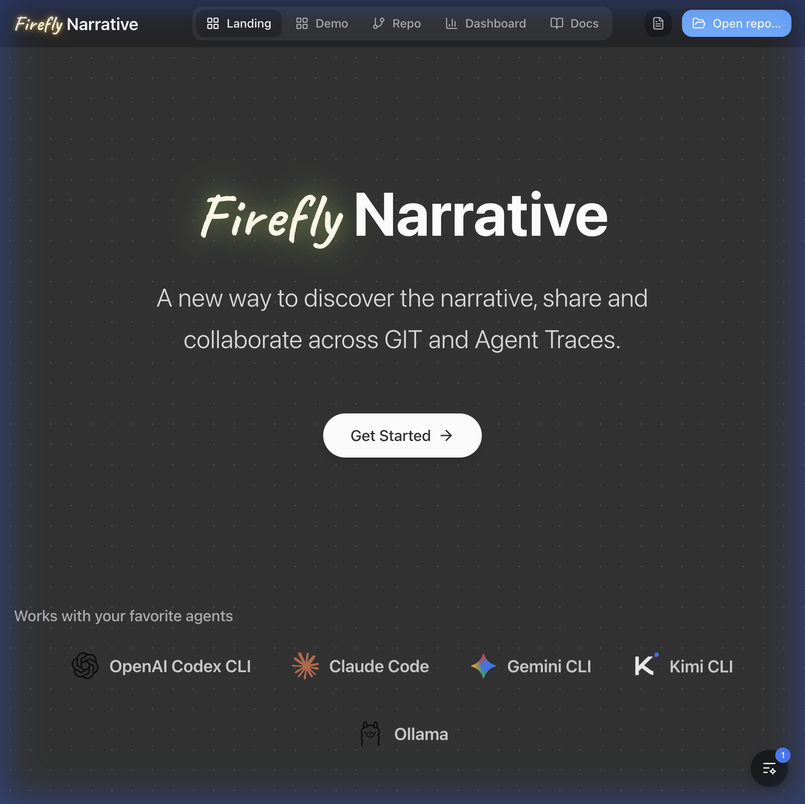
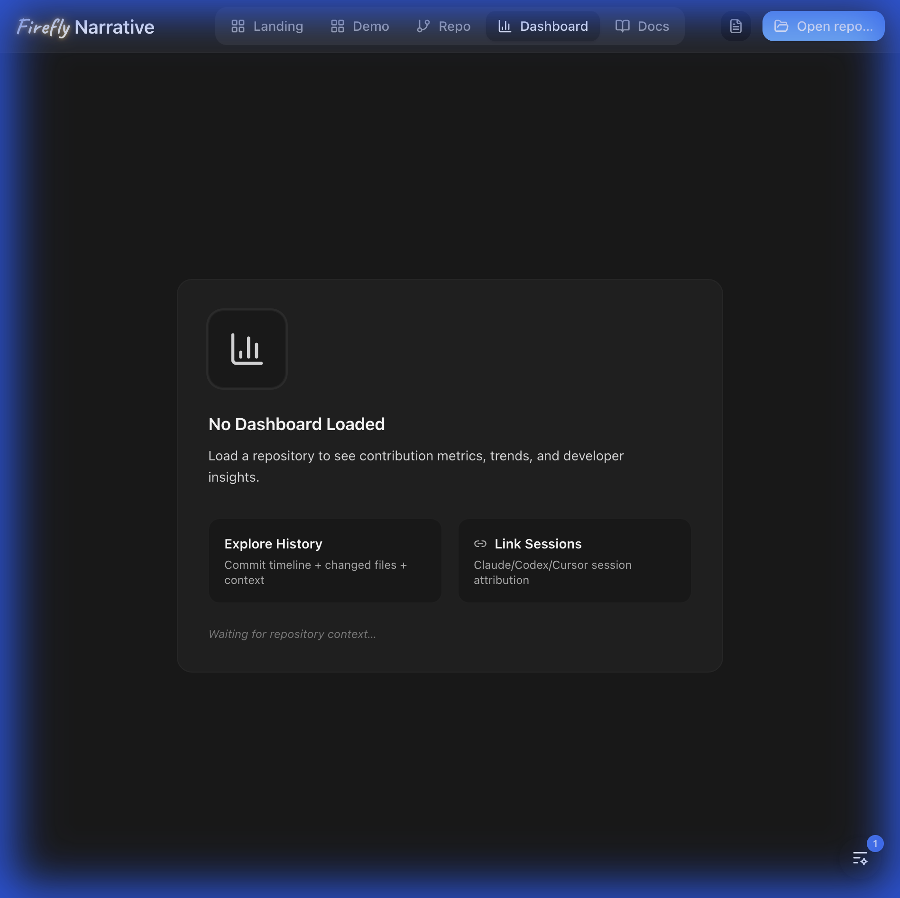
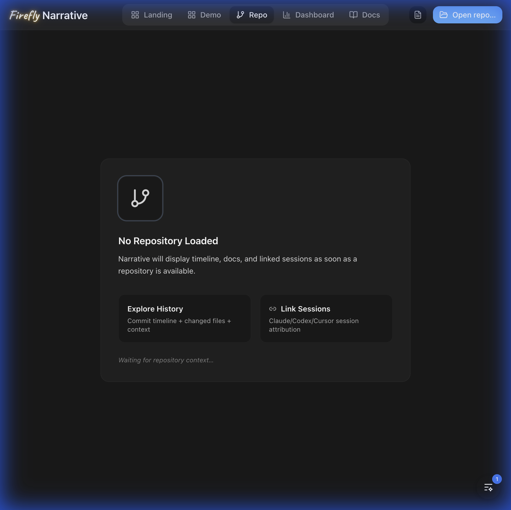
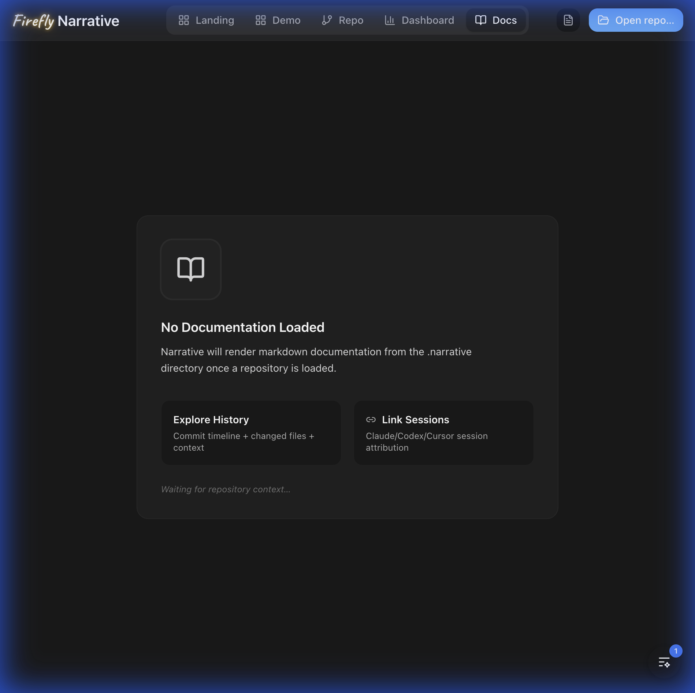

# Narrative

<div align="center">
  
</div>

<div align="center">

[](https://github.com/jscraik/narrative/actions)
[](LICENSE)
[](https://tauri.app)

</div>

<p align="center">
  <strong>Version control as a narrative medium.</strong><br>
  Capture the story behind your code - from AI prompts to commits.
</p>

<div align="center">
<h3>Quick Install</h3>

```bash
# macOS (Apple Silicon) - Recommended
curl -fsSL https://github.com/jscraik/narrative/releases/latest/download/Narrative_aarch64_mac.dmg -o Narrative.dmg
open Narrative.dmg
```

</div>

---

## TL;DR

**The Problem**: When you code with AI (Claude, Codex, Cursor), you lose rich context—intent, dead ends, and reasoning. Git commits only show *what* changed, not *why*.

**The Solution**: Narrative captures the full story: AI sessions → intent → commits → timeline. It links your conversations to your code, preserving the thought process behind every line.

### Why Use Narrative?

|Feature|What It Does|
|---|---|
|**📖 Context-Aware Timeline**|Navigate commits with linked AI conversations, not just diffs.|
|**🤖 AI Integration**|Import sessions from Claude Code, Codex CLI, and Cursor.|
|**🔍 Atlas Search**|Find "that thing we discussed about caching" instantly across all sessions.|
|**💾 Local-First**|All data stays in your `.narrative` folder. No cloud needed.|

---

## Visual Tour

### Dashboard

Get high-level insights into your AI-assisted workflow, tracking session impact and productivity.
<p align="center">
  
</p>

### Repository View

Navigate the commit timeline with rich context. See the "why" behind the code.
<p align="center">
  
</p>

### Documentation & Knowledge

Access project documentation and knowledge items directly within the narrative interface.
<p align="center">
  
</p>

---

## Quick Start

### Build from Source

**Prerequisites**: Node.js, pnpm, Rust toolchain, git.

```bash
# 1. Clone the repository
git clone https://github.com/jscraik/narrative.git
cd narrative

# 2. Install dependencies
pnpm install

# 3. Run the development environment
pnpm tauri dev
```

Then open a git repository and see your commit history come to life with narrative context.

---

## Features

- **Timeline View**: A new way to look at git history, focusing on the story.
- **Session Import**:
  - **Claude Code**: Import `.json` logs.
  - **Codex CLI**: Import session history.
  - **Cursor**: Drag and drop chat exports.
- **Atlas Search**: Full-text search across your entire narrative history.
- **Live Updates**: Watch your repo change in real-time.
- **Auto-Ingest**: Automatically capture sessions from supported tools.

---

## Documentation

- [Documentation Index](docs/README.md) — Full documentation map.
- [Development Setup](docs/agents/development.md) — How to set up your environment.
- [Testing Guide](docs/agents/testing.md) — Running tests and type checks.
- [Repository Structure](docs/agents/repo-structure.md) — Codebase layout overview.

---

## Troubleshooting

### "App opens but is empty"

Click "Open repo" and select a valid git repository. If you have not selected a repo, Narrative waits for your input.

### "Import failed"

Check that your log files are in the supported JSON format. See [Documentation](docs/README.md) for detailed format specifications.

### "Build errors"

Run `pnpm install` again. Ensure your Rust toolchain is up to date (`rustup update`).

---

## Community & Support

- Support channels and triage: [`SUPPORT.md`](SUPPORT.md)
- Security reporting: [`SECURITY.md`](SECURITY.md)
- Contributor workflow: [`CONTRIBUTING.md`](CONTRIBUTING.md)
- Community standards: [`CODE_OF_CONDUCT.md`](CODE_OF_CONDUCT.md)

---

## Contributing

We welcome contributions! Please read our [Contributing Guide](CONTRIBUTING.md). Narrative uses **tauri v2** (Rust backend + React frontend).

### Ways to Contribute

- **Bug reports** - [Open an issue](https://github.com/jscraik/narrative/issues/new?template=bug_report.yml)
- **Feature requests** - [Request a feature](https://github.com/jscraik/narrative/issues/new?template=feature_request.yml)
- **Code** - Look for [good first issues](https://github.com/jscraik/narrative/issues?q=is%3Aissue+is%3Aopen+label%3A%22good+first+issue%22)

---

## License

Apache-2.0. See [`LICENSE`](LICENSE).
