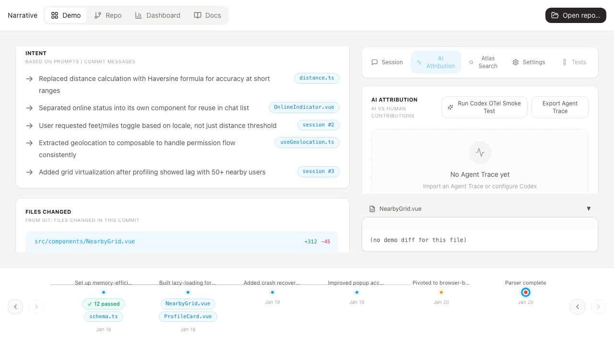

# Narrative

<p align="center">
  
</p>

<p align="center">
  <strong>Version control as a narrative medium</strong><br>
  Capture the story behind your code - from AI prompts to commits
</p>

<p align="center">
  <a href="#quick-start">Quick Start</a> •
  <a href="#verify-your-setup">Verify</a> •
  <a href="#troubleshooting">Troubleshooting</a> •
  <a href="#features">Features</a> •
  <a href="docs/README.md">Docs</a> •
  <a href="#community--support">Support</a>
</p>

---

## The Problem

When you code with AI (Claude Code, Codex, Cursor), the rich context — your intent, the conversation, dead ends, reasoning — disappears into the void. Your git commit only shows *what* changed, not *why*.

**Narrative captures the full story:** AI sessions → intent → commits → timeline.

<p align="center">
  
</p>

---

## Features

- **📖 Timeline View** — Navigate commits with context, not just diffs
- **🤖 AI Session Import** — Import Claude Code, Codex CLI, Cursor sessions
- **🔗 Session-to-Commit Linking** — See which AI conversations led to which commits
- **📊 Dashboard** — Insights into your AI-assisted workflow
- **🔍 Atlas Search** — Full-text search across all sessions and commits
- **💾 Local-First** — All data stays on your machine (`.narrative/` folder)

---

## Quick Start

### Download

Grab the latest release for macOS, Linux, or Windows from the [GitHub Releases page](https://github.com/jscraik/narrative/releases).

### Build from Source

**Prerequisites:** Node.js + pnpm, Rust toolchain, git

```bash
pnpm install
pnpm tauri dev
```

Then open a git repository and see your commit history with narrative context.

## Verify Your Setup

Run these checks after install:

```bash
pnpm typecheck
pnpm test
```

Expected result: both commands exit successfully.

## Troubleshooting

- `sh: tsc: command not found` -> run `pnpm install` from the repo root.
- tauri build/runtime dependency issues -> follow [`docs/agents/tauri.md`](docs/agents/tauri.md).
- App opens but no data appears -> open a valid git repository first, then import sessions.

---

## Documentation

- [`docs/README.md`](docs/README.md) — Documentation index
- [`docs/agents/development.md`](docs/agents/development.md) — Development setup
- [`docs/agents/testing.md`](docs/agents/testing.md) — Testing commands
- [`docs/agents/repo-structure.md`](docs/agents/repo-structure.md) — Codebase layout

---

## Community & Support

- Support channels and triage guidance: [`SUPPORT.md`](SUPPORT.md)
- Security reporting process: [`SECURITY.md`](SECURITY.md)
- Contributor workflow: [`CONTRIBUTING.md`](CONTRIBUTING.md)
- Community behavior expectations: [`CODE_OF_CONDUCT.md`](CODE_OF_CONDUCT.md)

---

## Contributing

We'd love your help. Narrative uses **tauri v2** (Rust backend + React frontend).

### Quick Setup

```bash
pnpm install
pnpm tauri dev
```

### Ways to Contribute

- **Bug reports** - [Open an issue](https://github.com/jscraik/narrative/issues/new?template=bug_report.yml)
- **Feature requests** - [Request a feature](https://github.com/jscraik/narrative/issues/new?template=feature_request.yml)
- **Code** - Look for [good first issues](https://github.com/jscraik/narrative/issues?q=is%3Aissue+is%3Aopen+label%3A%22good+first+issue%22)
- **Documentation** - Help improve docs and examples
- **Testing** - Test behavior across platforms

---

## Tech stack

- **Frontend:** React 19 + TypeScript + Tailwind CSS v4 + Vite
- **Backend:** Rust (tauri v2) + git2
- **Database:** SQLite (tauri-plugin-sql)
- **Build:** Cargo (Rust) + pnpm (Node)

---

## What gets written to your repo

When you open a repo, Narrative creates a `.narrative/` folder:

```text
.narrative/
├── meta/
│   ├── repo.json
│   ├── branches/<branch>.json
│   └── commits/<sha>.json
└── sessions/
    └── imported/*.json
```

These files are **committable** — share the narrative layer with your team.

---

## Roadmap

- [x] Session import and viewing
- [x] Commit timeline with file changes
- [x] Session-to-commit linking
- [x] Atlas search (full-text session search)
- [ ] Auto-import from Claude Code / Codex CLI logs
- [ ] Git notes integration for team sync
- [ ] Multi-level narrative (commits → sessions → milestones)
- [ ] "Speculate" mode — predict file changes from history

---

## Maintainer

- [@jscraik](https://github.com/jscraik)

## License

Use this project under the **Apache-2.0** license. See [`LICENSE`](LICENSE).

## Metadata

- Owner: @jscraik
- Last updated: 2026-02-16

<p align="center">
  
</p>

<p align="center">
  <em>from demo to duty</em>
</p>

<p align="center">
  Built with ❤️ by <strong>brAInwav</strong>
</p>
