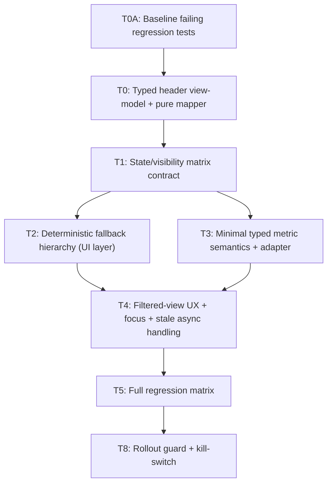

# fix: Restore BranchHeader visibility and repo/demo context parity

## Enhancement Summary

**Deepened on:** 2026-02-18  
**Technical review applied:** @agent-dhh-rails-reviewer, @agent-kieran-rails-reviewer, @agent-code-simplicity-reviewer (2026-02-18)  
**Sections enhanced:** 10

### Key Improvements
1. Narrowed scope to a focused parity fix (BranchHeader visibility/content contract + tests).
2. Reordered work to test-first (baseline failing regression coverage before implementation).
3. Added explicit typed view-model contract (`hidden | shell | full`) and mapper boundary.
4. Added deterministic stale async handling requirement for rapid repo/mode transitions.
5. Deferred telemetry/performance hardening to a separate follow-up track (YAGNI for this fix).

### New Considerations Discovered
- BranchHeader parity is primarily a UI/data contract issue, not a full narrative-system issue.
- Fix reliability depends on deterministic mapper behavior and transition safety.
- Rollout should include a kill-switch to reduce risk if regressions appear.

## Overview
Repo mode can appear to skip or under-render the BranchHeader and feel much sparser than demo mode. This plan defines a constrained fix that restores predictable header behavior and parity expectations without broad architecture changes.

## Problem Statement / Motivation
Users expect the branch context card to appear above INTENT in repo-ready state. Current behavior can feel broken or low-signal because:
- Header fields rely on sparse repo metadata.
- Demo mode is curated while repo mode is live and sparse.
- Visibility/content rules are implicit and not fully regression-tested.

## Brainstorm Context
No dedicated bug brainstorm document was selected for this issue. This plan is grounded in repo analysis plus deepening + technical review synthesis.

## Research Summary (Internal)
- BranchHeader is mounted above INTENT in BranchView (`src/ui/views/BranchView.tsx:579-614`).
- BranchHeader currently lacks robust fallback copy for empty/low-signal title/description (`src/ui/components/BranchHeader.tsx:33-57`).
- Repo model title/description can be sparse and path-heavy (`src/core/repo/indexer.ts:270-284`).
- Demo data is intentionally richer (`src/core/demo/nearbyGridDemo.ts:151-339`).
- Repo commit/file details are lazy-loaded (`src/hooks/useCommitData.ts:53-103`).

## Proposed Solution (High-Level)
1. Define explicit BranchHeader visibility/content contracts by mode and repo state.
2. Use a pure mapper to derive display model with deterministic fallback precedence.
3. Introduce minimal typed metric semantics to avoid conflating unavailable with numeric zero.
4. Align filtered-view affordance + keyboard/focus behavior.
5. Add targeted regression tests and rollout guard; defer broad telemetry/perf hardening to follow-up.

## Technical Considerations
- Keep scope as bug-fix + parity hardening pass (no broad repo/indexer refactor).
- Keep derivation in render-time pure mapping (no Effect-driven derived text/stats sync).
- Use explicit typed contract with exhaustive handling for header view states.
- Require deterministic stale async handling for rapid transition scenarios.
- Add feature-flag kill-switch for safe rollout (`branchHeaderParityV1`).

### Contract Requirements
- `BranchHeaderViewModel` must be a discriminated union:
  - `hidden`
  - `shell` (loading/error)
  - `full` (ready)
- `HeaderMetric` must be typed as:
  - `{ kind: 'known'; value: number }`
  - `{ kind: 'unavailable'; reason: HeaderMetricUnavailableReason }`
- `HeaderMetricUnavailableReason` enum values (v1) are explicit and bounded:
  - `NO_TRACE_DATA`
  - `SOURCE_UNSUPPORTED`
  - `LOADING`
  - `PERMISSION_DENIED`
  - `ERROR`
- Existing numeric stats must be adapted at mapper boundary (no `0` overloading for unavailable).
- Request identity key parts must be canonically normalized before comparison:
  - `repoKey`: stable repo identity (normalized path or repo UUID, lowercased where applicable)
  - `mode`: explicit enum value
  - `filterKey`: stable serialized filter signature (sorted keys, deterministic string form)
- Add explicit key-collision regression coverage for request identity normalization.

## Pre-Implementation Debugging Gate (Root-Cause First, Mandatory)

### Debugging Validation Flow
1. Lock symptom definition by state: `demo`, `repo/loading`, `repo/ready`, `repo/error`, `dashboard-filtered`.
2. Trace boundaries before fixes:
   - `src/App.tsx` route/mode gating
   - `src/hooks/useCommitData.ts` model readiness and transitions
   - `src/ui/views/BranchView.tsx` header mount/order
   - `src/ui/components/BranchHeader.tsx` payload rendering
3. Capture evidence snapshots per scenario (`mode`, `repoState.status`, `model.source`, `title`, `description`, `stats`, `dashboardFilter`).
4. Form one root-cause hypothesis at a time.
5. Add failing tests first.
6. Implement only after failing tests reproduce behavior.

### Evidence Checkpoints
- **E1:** reproducible scenario.
- **E2:** render path proof.
- **E3:** header mount proof.
- **E4:** payload quality proof.
- **E5:** unavailable-vs-known semantics proof.
- **E6:** baseline failing tests in place.

## Implementation Tasks

### Dependency Graph

### Core Delivery Task Breakdown
| ID | Task | Primary file targets | depends_on |
|---|---|---|---|
| T0A | Add baseline failing regression tests that reproduce current parity bug before implementation changes | `src/ui/components/__tests__/BranchHeader.test.tsx`, `src/ui/views/__tests__/BranchView.test.ts`, `src/core/repo/__tests__/indexer.test.ts` | [] |
| T0 | Define `BranchHeaderViewModel` (`hidden | shell | full`) and implement `deriveBranchHeaderViewModel(...)` with exhaustive checks | `src/core/types.ts`, `src/ui/components/branchHeaderMapper.ts`, `src/ui/components/BranchHeader.tsx`, `src/ui/views/BranchView.tsx` | [T0A] |
| T1 | Implement explicit visibility/content matrix by mode + repo state + filter context | `src/App.tsx`, `src/ui/views/BranchView.tsx`, `src/ui/components/RepoEmptyState.tsx` | [T0] |
| T2 | Implement deterministic description fallback hierarchy (`narrative.summary → intent-derived → generic`) in UI mapper; prevent raw-path-only description | `src/ui/components/branchHeaderMapper.ts`, `src/ui/components/BranchHeader.tsx` | [T1] |
| T3 | Implement minimal typed metric semantics (`known` vs `unavailable`) via adapter boundary; remove numeric-zero overloading | `src/core/types.ts`, `src/ui/components/branchHeaderMapper.ts`, `src/ui/components/BranchHeader.tsx` | [T1] |
| T4 | Align filtered-view affordance and keyboard/focus behavior; add out-of-order async result protection using canonically normalized request identity key `{repoKey, mode, filterKey}` with versioning/abort semantics (including ABA transition + key-collision coverage) | `src/ui/views/BranchView.tsx`, `src/hooks/useCommitData.ts`, `src/ui/components/BranchHeader.tsx` | [T2, T3] |
| T5 | Expand regression matrix for visibility/content parity and transition/focus behavior | `src/ui/components/__tests__/BranchHeader.test.tsx`, `src/ui/components/__tests__/branchHeaderMapper.test.ts`, `src/ui/views/__tests__/BranchView.test.ts` | [T4] |
| T8 | Add rollout guard (`branchHeaderParityV1`) + kill-switch fallback path + rollback notes | `src/App.tsx`, `src/ui/views/BranchView.tsx`, `src/core/types.ts` | [T5] |

### Execution Status (2026-02-18)
- [x] T0A baseline failing regression tests added
- [x] T0 typed header view-model + pure mapper implemented
- [x] T1 visibility/content matrix wiring implemented (ready/full + shell support in mapper)
- [x] T2 deterministic description fallback hierarchy implemented (path-only guarded)
- [x] T3 typed metric semantics + adapter boundary implemented (`known` vs `unavailable`)
- [x] T4 normalized request identity + versioning/abort stale-result protection implemented
- [x] T5 regression matrix expanded (mapper + header component + view tests)
- [x] T8 rollout guard (`VITE_BRANCH_HEADER_PARITY_V1`) and fallback wiring implemented
- [x] H1 low-noise UI quality telemetry schema (`v1`) implemented with bounded enums and transition-only emission
- [x] H2 header derivation performance instrumentation/budget checks implemented

### Hardening Track (Completed 2026-02-18)
| ID | Task | Primary file targets | Status |
|---|---|---|---|
| H1 | Add low-noise UI quality telemetry schema (`v1`) with bounded enums and transition-only emission | `src/core/telemetry/narrativeTelemetry.ts`, `src/ui/views/BranchView.tsx` | Done |
| H2 | Add performance instrumentation/budgets for header derivation path | `src/ui/views/BranchView.tsx`, profiling docs/artifacts | Done |

## Acceptance Criteria
- [ ] In `repo` mode with `repoState.status = ready`, BranchHeader renders exactly once above INTENT.
- [ ] In `repo/loading` and `repo/error`, full-content BranchHeader is not shown; shell messaging is explicit and non-duplicative.
- [ ] Detached HEAD/missing branch has deterministic non-empty title fallback (`branchName → short HEAD SHA → “Repository overview”`).
- [ ] Description fallback precedence is deterministic and tested (`narrative.summary → intent-derived → generic`).
- [ ] BranchHeader description never renders raw absolute path as final display text.
- [ ] Header metrics distinguish unavailable vs known values via typed contract (no numeric-zero overload).
- [ ] Filtered-view affordance is consistent and keyboard accessible; focus restoration is deterministic.
- [ ] BranchHeader has labeled-region semantics and preserves keyboard flow.
- [ ] Out-of-order async results are ignored via canonically normalized request identity key `{repoKey, mode, filterKey}` plus versioning/abort semantics; no stale header flash on rapid transitions (including ABA transitions).
- [ ] Pending async updates are cancelled or ignored on unmount and rapid mode/repo flips; stale updates must never commit.
- [ ] Test suite covers demo-ready, repo-ready, repo-loading, repo-error, sparse-data, filtered transitions, ABA/unmount transition races, and request-key collision scenarios.
- [ ] `branchHeaderParityV1` flag + kill-switch fallback are documented and verified.

## Success Metrics
| Metric | Target |
|---|---|
| BranchHeader presence above INTENT in repo-ready state | 100% (test matrix) |
| Path-only header description rate | 0% |
| Empty title/description rate in ready state | <0.1% |
| Transition stale-header flash rate (rapid toggles) | 0% in automated transition tests |
| Render/perceived performance for this fix | No regression (>5% increase fails) |

## Dependencies & Risks
### Dependencies
- Existing repo loading/indexing APIs remain available.
- Test harness supports component + integration + hook-level transition tests.

### Risks
- Scope creep into indexer/narrative refactor delays shipping.
- Transition handling bugs can cause stale flashes during rapid mode/repo switches.
- Kill-switch path can drift if not tested alongside primary path.

### Mitigations
- Keep changes local to mapper + BranchView/BranchHeader + transition handling.
- Enforce test-first and state-matrix coverage.
- Validate both flag-on and flag-off behavior in CI.

## Validation Plan
- Unit tests for mapper contract and fallback precedence.
- Component tests for BranchHeader rendering semantics (hidden/shell/full).
- Hook/integration tests for transition race handling and focus restoration (including ABA and unmount-in-flight cases).
- Manual QA scenarios: detached HEAD, sparse commits, no telemetry data, reduced-motion, 200% zoom, rapid repo/mode toggles.
- Rollout dry run with flag on/off and rollback simulation.

### Test Matrix (must pass)
| Scenario | Expected |
|---|---|
| `repo:ready` + sparse data | Header visible + non-path fallback text |
| `repo:loading` | Shell visible, no full-content BranchHeader |
| `repo:error` | Error shell + deterministic recovery CTA |
| `demo:ready` | Same header shell, source-specific content |
| `dashboard-filtered` | Clear/back action consistent + focus restored |
| rapid repo/mode toggles | No stale header flash; latest request wins |
| ABA transition (`A → B → A`) | No stale intermediate commit; final `A` reflects latest request identity |
| request key collision normalization | Distinct logical requests never share identity key; stale commit blocked |
| unmount during in-flight request | No stale state commit and no unmounted-update warnings |
| unavailable metrics | `unavailable` semantic shown, not numeric zero |

## References & Research
### Internal
- `src/ui/views/BranchView.tsx:579-614`
- `src/ui/components/BranchHeader.tsx:33-57`
- `src/core/repo/indexer.ts:119-126`
- `src/core/repo/indexer.ts:270-284`
- `src/hooks/useCommitData.ts:53-103`
- `src/core/demo/nearbyGridDemo.ts:151-339`
- `docs/brainstorms/2026-02-18-trace-quality-hardening-brainstorm.md`

### External (selected)
- React docs: https://react.dev/learn/you-might-not-need-an-effect
- React docs: https://react.dev/learn/preserving-and-resetting-state
- Testing Library disappearance guide: https://testing-library.com/docs/guide-disappearance/
- Testing Library role queries: https://testing-library.com/docs/queries/byrole
- WAI-ARIA APG focus guidance: https://www.w3.org/WAI/ARIA/apg/patterns/dialog-modal/
