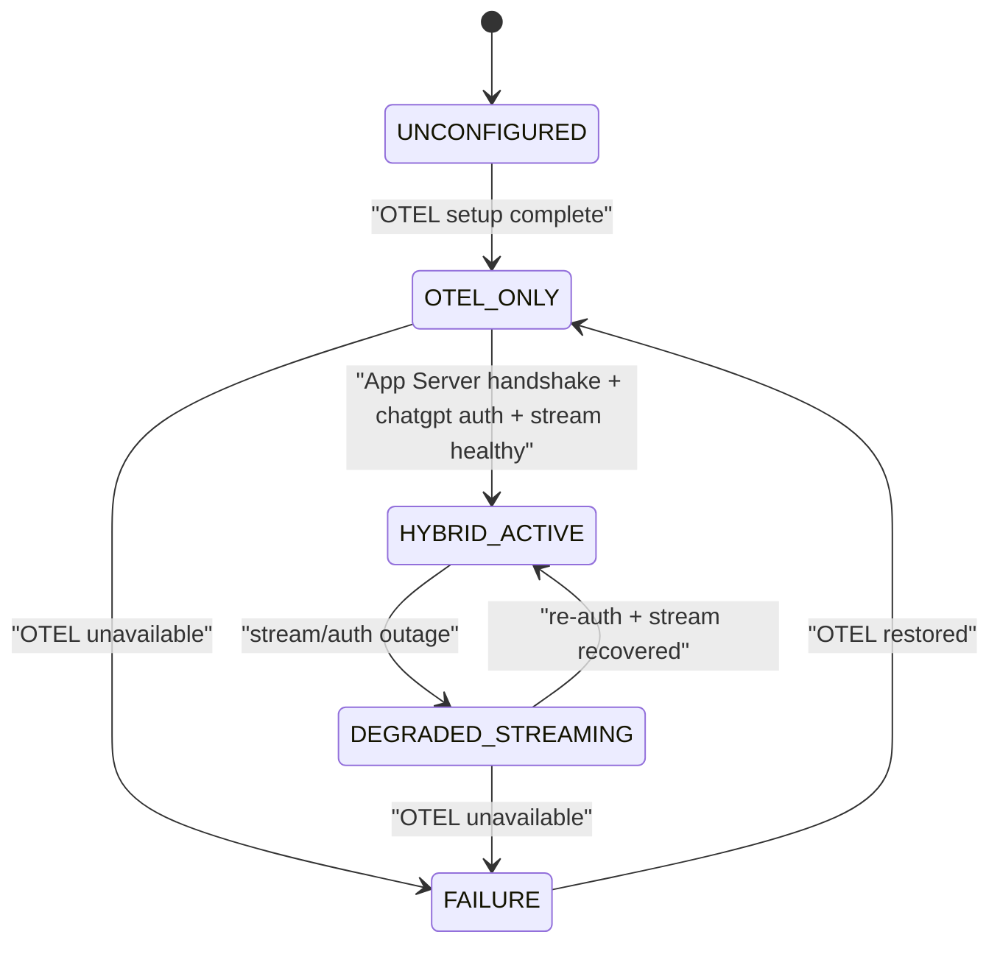
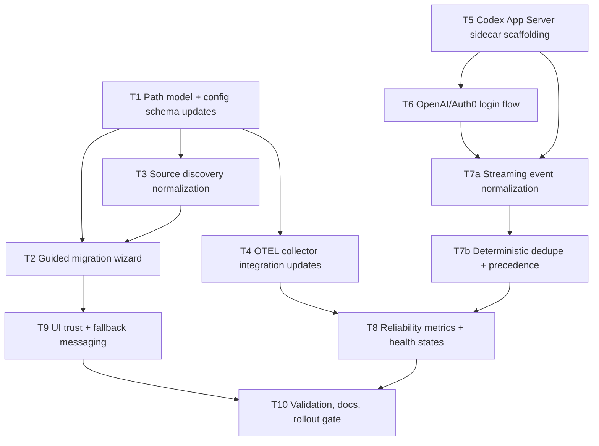

# feat: Hybrid Codex-Claude Capture Reliability v1

## Table of Contents
- [Enhancement Summary](#enhancement-summary)
- [Overview](#overview)
- [Brainstorm Context Used](#brainstorm-context-used)
- [Research Summary](#research-summary)
- [Scope](#scope)
- [SpecFlow Analysis (Manual Fallback)](#specflow-analysis-manual-fallback)
- [Proposed Solution](#proposed-solution)
- [Dependency Graph](#dependency-graph)
- [Implementation Tasks](#implementation-tasks)
- [Execution Progress (2026-02-19)](#execution-progress-2026-02-19)
- [Acceptance Criteria](#acceptance-criteria)
- [Success Metrics](#success-metrics)
- [Dependencies & Risks](#dependencies--risks)
- [Validation Plan](#validation-plan)
- [References](#references)

## Enhancement Summary
**Deepened on:** 2026-02-19  
**Sections enhanced:** 12  
**Research sources used:** OpenAI Codex docs (`app-server`, `auth`, `config-reference`), Tauri v2 sidecar docs (Context7), repo-grounded architecture findings.

### Key improvements
1. Added an explicit capture-state machine (`UNCONFIGURED -> OTEL_ONLY -> HYBRID_ACTIVE -> DEGRADED_STREAMING -> FAILURE`) with transition triggers.
2. Split streaming work into `T7a` (event normalization) and `T7b` (dedupe precedence) to reduce coupling and improve testability.
3. Tightened App Server auth contract around documented methods (`account/read`, `account/login/start`, `account/login/completed`, `account/updated`, `account/logout`) with a strict v1 `chatgpt` auth-mode policy.
4. Strengthened rollout safety with kill-switch, sidecar crash-loop handling, and deterministic OTEL-only fallback behavior.
5. Expanded validation with failure-injection scenarios (auth cancellation, sidecar restarts, duplicate overlap).

### New considerations discovered
- The App Server rejects non-handshake requests before `initialize` + `initialized`; startup sequencing must be strict.
- `account/updated` is the canonical auth-mode state signal and should drive UI/state transitions.
- Tauri sidecar permissions should be narrowly scoped via `shell:allow-execute` and `bundle.externalBin` for the specific binary only.

## Overview
Deliver a reliability-first v1 for Codex + Claude capture that preserves the universal multi-tool direction without broadening scope.

This plan implements the selected hybrid approach:
- Shared OTEL baseline capture for Codex + Claude
- Additional Codex App Server streaming for near-real-time Codex visibility
- Canonical collector path migration to `~/.agents/otel/collector`
- OpenAI/Auth0 login-first for Codex App Server, with OTEL-only fallback when auth is unavailable

**v1 done means:** legacy users migrate safely, OTEL capture stays continuous, and Codex stream enrichment is additive (never required for baseline reliability).

### Research Insights
**Best practices:**
- Treat OTEL as the durable baseline and App Server stream as additive/low-latency enrichment.
- Model reliability as explicit states + transitions, not implicit booleans.
- Keep ingestion truth deterministic (`item/completed` + OTEL record reconciliation), never “best effort” merge.

**Performance considerations:**
- Batch stream-to-session normalization in micro-batches to prevent UI churn.
- Protect ingest pipelines with bounded queues and drop counters (visible to users/operators).

**Edge cases:**
- Login succeeds but transport fails immediately after: force state `DEGRADED_STREAMING` and retain OTEL capture.
- Sidecar restart mid-turn: tolerate missing deltas and recover on next completed item/backfill.

## Brainstorm Context Used
Found brainstorm from 2026-02-19: `hybrid-capture-reliability`. Using as planning context:
- `/Users/jamiecraik/dev/narrative/docs/brainstorms/2026-02-19-hybrid-capture-reliability-brainstorm.md`

Locked decisions carried forward:
1. Approach B (hybrid reliability-first)
2. Canonical collector path: `~/.agents/otel/collector`
3. Guided migration wizard (one-click move) from `~/.codex/otel-collector`
4. Codex App Server auth via OpenAI/Auth0 login (not API-key-first)
5. Auth outage fallback to OTEL-only Codex capture

## Research Summary

### Local repo findings
- Existing ingest config + source discovery currently hard-code `.codex` sources and defaults:
  - `/Users/jamiecraik/dev/narrative/src-tauri/src/ingest_config.rs`
  - `/Users/jamiecraik/dev/narrative/src/core/tauri/ingestConfig.ts`
- Existing UI supports auto-detect and watch-path editing; this is the correct insertion point for guided migration UX:
  - `/Users/jamiecraik/dev/narrative/src/ui/components/AutoIngestSetupPanel.tsx`
- Existing Codex OTEL setup writes to `~/.codex/config.toml` and inserts `[otel]` block with keychain-backed header:
  - `/Users/jamiecraik/dev/narrative/src-tauri/src/ingest_config.rs`
  - `/Users/jamiecraik/dev/narrative/src-tauri/src/secret_store.rs`
- Existing ingestion reliability building blocks already exist (backfill, dedupe skip, activity log, purge):
  - `/Users/jamiecraik/dev/narrative/src-tauri/src/import/commands.rs`
  - `/Users/jamiecraik/dev/narrative/src-tauri/src/activity.rs`
- Existing OTLP receiver is operational and integrated with repo state:
  - `/Users/jamiecraik/dev/narrative/src-tauri/src/otlp_receiver.rs`
  - `/Users/jamiecraik/dev/narrative/src/hooks/useAutoIngest.ts`
- No Codex App Server runtime/client code exists yet in `src-tauri/src`; only prior docs/plans mention it.

### Institutional learnings
- `docs/solutions/` is absent; nearest learnings are from brainstorms/plans/reports:
  - `/Users/jamiecraik/dev/narrative/docs/brainstorms/2026-02-18-trace-quality-hardening-brainstorm.md`
  - `/Users/jamiecraik/dev/narrative/docs/plans/2026-02-17-feat-universal-agent-tracking-plan.md`
  - `/Users/jamiecraik/dev/narrative/docs/notes/plans/PLANS.txt`
- Existing quality guidance emphasizes: no silent drops, per-source visibility, and strong linkage quality signals.

### External research (required: external API/auth topic)
- Codex App Server lifecycle and event model (`initialize`/`initialized`, thread/turn/item flow):
  - `https://developers.openai.com/codex/app-server/#lifecycle-overview`
- Codex App Server auth methods and notifications (`account/login/start`, `account/login/completed`, `account/updated`):
  - `https://developers.openai.com/codex/app-server/#api-overview-1`
- Codex authentication modes and admin enforcement (`forced_login_method = "chatgpt"`):
  - `https://developers.openai.com/codex/auth/`
  - `https://developers.openai.com/codex/config-reference/#configtoml`
- Tauri v2 sidecar packaging + capability scoping (`bundle.externalBin`, `shell:allow-execute`):
  - `https://v2.tauri.app/develop/sidecar/`

## Scope

### In scope (v1)
- Canonicalize collector path to `~/.agents/otel/collector` for Codex/Claude capture state.
- Add guided migration flow from `~/.codex/otel-collector` to new canonical location.
- Introduce Codex App Server sidecar + JSON-RPC client for Codex streaming only.
- Implement OpenAI/Auth0 login flow for Codex App Server integration.
- Implement deterministic OTEL fallback behavior and clear degraded-state signaling.
- Add kill-switch and rollout controls to disable stream enrichment without disabling baseline OTEL capture.

### Out of scope (v1)
- Full multi-provider real-time parity (e.g., Claude MCP streaming).
- New agent adapters beyond Codex + Claude.
- Unrelated feature expansion outside capture reliability.
- Replacing existing OTEL ingestion architecture.

## SpecFlow Analysis (Manual Fallback)
`spec-flow-analyzer` helper is unavailable in this environment; manual equivalent applied.

### Primary actors
- User configuring auto-ingest
- Narrative Tauri backend ingest pipeline
- Codex App Server sidecar
- OTEL collector + receiver pipeline

### Primary states
1. **UNCONFIGURED**: no migrated collector path + no login
2. **OTEL_ONLY**: baseline capture active (Codex + Claude)
3. **HYBRID_ACTIVE**: OTEL baseline + Codex streaming active
4. **DEGRADED_STREAMING**: OTEL active, streaming unavailable
5. **FAILURE**: both OTEL and streaming unavailable

### Key edge cases
- Legacy path detected but migration canceled/deferred
- Migration partially fails or rollback needed
- Auth succeeds but App Server transport fails
- Duplicate session events across OTEL + App Server
- Re-login/token refresh during active capture
- Sidecar process crash-loop after app update

### Design implication
Plan includes explicit fallback contract, dedupe precedence, and release-gate checks so reliability remains deterministic under degraded conditions.

## Proposed Solution

### Architecture
1. Keep OTEL baseline ingestion as the durable default for Codex + Claude.
2. Add Codex App Server sidecar in Tauri backend for streamed Codex events.
3. Normalize streamed Codex session artifacts into existing ingestion/session-linking model.
4. Add migration wizard in setup surfaces to move canonical collector state to `~/.agents/otel/collector`.
5. Enforce login-first App Server operation (OpenAI/Auth0), while keeping OTEL ingestion available when login is unavailable.
6. Introduce explicit health-state FSM and transition audit events for observability.

### Research Insights
**Best practices:**
- Drive auth/session state from App Server notifications, especially `account/updated`.
- Keep stream ingestion append-only until final reconciliation to avoid mutation races.
- Persist source attribution per event (`otel`, `app_server_stream`) to improve debugging and trust UI.

**Performance considerations:**
- Coalesce high-frequency `item/agentMessage/delta` updates before UI projection.
- Prefer idempotent upserts keyed by deterministic event identity to reduce dedupe cost.

**Implementation details:**
- Handshake guard: no thread/turn requests before successful `initialize` + `initialized`.
- Auth preflight: call `account/read` during startup and after reconnect.
- Auth mode policy: accept `chatgpt` (interactive browser login) as the required mode for v1.

**Edge cases:**
- Login canceled (`account/login/cancel`) must return to OTEL_ONLY without blocking ingestion setup.
- Auth refresh failures must not deadlock turn processing or OTEL ingestion fallback.

### Fallback behavior contract
- **Normal (`HYBRID_ACTIVE`):** OTEL + App Server streaming active.
- **Auth/stream outage (`DEGRADED_STREAMING`):** continue OTEL ingestion; mark streaming unavailable and surface actionable recovery guidance.
- **Severe outage (`FAILURE`):** neither source healthy; show explicit capture failure + next-step remediation.
- **Recovery:** transition back to `HYBRID_ACTIVE` only after handshake, auth mode confirmation, and stream health checks pass.

### Capture state machine

## Dependency Graph

## Implementation Tasks

### Execution Progress (2026-02-19)
- [x] T1 Path model + config schema updates
- [x] T2 Guided migration wizard
- [x] T3 Source discovery normalization
- [x] T4 OTEL collector integration updates
- [x] T5 Codex App Server sidecar scaffolding
- [x] T6 OpenAI/Auth0 login flow (chatgpt-mode contract + auth-state reconciliation hooks)
- [x] T7a Streaming event normalization (canonical envelope + identity keying)
- [x] T7b Deterministic dedupe + precedence
- [x] T8 Reliability metrics + health states
- [x] T9 UI trust + fallback messaging
- [x] T10 Validation, docs, rollout gate (rollout runbook + UI evidence captured; production thresholds remain tunable)

### T1. Path model + config schema updates
- **depends_on:** []
- Update ingest config model to support canonical collector root (`~/.agents/otel/collector`) while preserving backward-compatible read-paths.
- Introduce explicit migration status state in app-level config (not repo-committed metadata).
- Add config contract tests in `src-tauri/src/ingest_config.rs` and `src/core/tauri/ingestConfig.ts` coverage targets.

### T2. Guided migration wizard
- **depends_on:** [T1, T3]
- Add first-run and on-demand wizard flow for legacy `.codex` collector migration.
- Include one-click move, preflight checks, dry-run summary, and post-migration confirmation.
- Non-destructive behavior is required: backup snapshot + rollback affordance.
- Add failure UX copy for partial migration and safe retry path.

### T3. Source discovery normalization
- **depends_on:** [T1]
- Extend source discovery to prioritize `~/.agents/otel/collector` and report legacy `.codex` paths as migratable, not canonical.
- Preserve existing Claude/Cursor discovery behavior.
- Emit normalized discovery diagnostics for UI + support logs.

### T4. OTEL collector integration updates
- **depends_on:** [T1]
- Align OTEL setup/configuration flow with canonical collector root.
- Ensure existing keychain-based header key behavior remains intact.
- Preserve backwards compatibility for users who have not migrated yet.

### T5. Codex App Server sidecar scaffolding
- **depends_on:** []
- Add Tauri sidecar bundling and capability permissions scoped to the app-server binary (`bundle.externalBin` + constrained `shell:allow-execute`).
- Add JSONL/JSON-RPC transport client with strict `initialize` -> `initialized` lifecycle.
- Add sidecar process supervision with bounded restart budget (max 3 restarts in 60s) and crash-loop detection.

### T6. OpenAI/Auth0 login flow
- **depends_on:** [T5]
- Implement account auth flow via App Server auth endpoints (`account/read`, `account/login/start`, `account/login/completed`, `account/updated`, `account/logout`).
- Enforce login-first for App Server streaming sessions using `chatgpt` auth mode in v1.
- Treat API key login and host-managed token modes as deferred post-v1 UX paths.
- Add auth state reconciliation on startup/reconnect.

### T7a. Streaming event normalization
- **depends_on:** [T5, T6]
- Map Codex thread/turn/item events to existing session model.
- Define source-tagged canonical event envelope before dedupe.
- Handle partial streams and reconnect continuity safely.

### T7b. Deterministic dedupe + precedence
- **depends_on:** [T7a]
- Add deterministic precedence rules between OTEL and App Server events.
- Define stable identity keys and reconciliation ordering.
- Define and document canonical event identity contract (`provider`, `thread_id`, `turn_id`, `item_id`, `event_type`) used by dedupe.
- Version the event identity contract to preserve compatibility across schema evolution.
- Log dedupe decisions for troubleshooting and trust UI.

### T8. Reliability metrics + health states
- **depends_on:** [T4, T7b]
- Track source-level ingest/linkage metrics and degraded-state markers.
- Expose health state transitions for OTEL-only fallback and full failure.
- Add transition audit events for state debugging.

### T9. UI trust + fallback messaging
- **depends_on:** [T2, T8]
- Surface migration status, current capture mode, and explicit fallback messaging in setup/panels.
- Preserve trust semantics: no silent failure states.
- Cap user-facing status taxonomy to 4 clear states (`OTEL_ONLY`, `HYBRID_ACTIVE`, `DEGRADED_STREAMING`, `FAILURE`).
- Add clear recovery actions for degraded/failure states.

### T10. Validation, docs, rollout gate
- **depends_on:** [T8, T9]
- Add/extend tests and manual validation scenarios.
- Update docs and release notes with migration and fallback behavior.
- Add feature flag to disable stream enrichment without disabling OTEL ingestion.
- Define phased rollout and rollback trigger thresholds.
- Document operator runbook for emergency fallback to OTEL-only mode.
- Run go/no-go checklist against acceptance criteria.

## Acceptance Criteria

### Functional requirements
- [x] Legacy `.codex` collector users get a guided migration wizard with one-click move.
- [x] Canonical collector path is `~/.agents/otel/collector` after successful migration/new setup.
- [x] Codex App Server sidecar enforces `initialize` + `initialized` before thread/turn requests.
- [x] App Server login path uses OpenAI/Auth0 sign-in flow (`chatgpt`) for streaming UX.
- [x] On auth outage, Codex capture degrades to OTEL-only without stopping ingestion.
- [x] Sidecar crash-loop protection degrades to OTEL-only safely within restart budget.
- [x] Duplicate Codex events from OTEL + App Server resolve deterministically into one narrative view.
- [x] UI always displays the current capture mode (`OTEL_ONLY`, `HYBRID_ACTIVE`, `DEGRADED_STREAMING`, `FAILURE`).

### Non-functional requirements
- [x] No silent ingestion failures; degraded states are visible to users.
- [x] Existing Codex/Claude OTEL baseline remains backward compatible during rollout.
- [x] Migration flow is idempotent and non-destructive.
- [x] Sidecar permission scope is least-privilege and limited to the bundled binary.
- [x] Sidecar supervision enforces bounded restart attempts (max 3 restarts in 60s) before automatic OTEL-only degradation.

### Quality gates
- [ ] Source-level ingest success rate is >=95% for Codex and >=95% for Claude.
- [ ] Attribution linkage success rate is >=90% for sessions eligible for linking.
- [ ] Replayability checks pass for hybrid mode and OTEL-only fallback mode with zero silent-drop states.
- [ ] Degraded-state transition visibility appears within 5 seconds of source outage detection.

## Success Metrics
- **Capture continuity:** Codex and Claude sessions continue ingesting through auth outage scenarios.
- **Migration completion:** High completion rate for guided migration among legacy `.codex` users.
- **Fallback clarity:** Degraded-state messaging appears whenever streaming is unavailable.
- **Trust stability:** No increase in unresolved/ambiguous session linkage after hybrid rollout.
- **Operational recoverability:** MTTR from `DEGRADED_STREAMING` to `HYBRID_ACTIVE` stays within target SLO.

## Dependencies & Risks

### Dependencies
- Tauri sidecar permission updates in:
  - `/Users/jamiecraik/dev/narrative/src-tauri/capabilities/default.json`
- Sidecar bundling updates in:
  - `/Users/jamiecraik/dev/narrative/src-tauri/tauri.conf.json`
- App Server binary packaging strategy compatible with current Tauri build/release flow.
- Codex App Server auth method support and endpoint behavior as documented.

### Risks
- **Dual-source duplication risk:** OTEL + App Server may produce overlapping records.
  - Mitigation: explicit precedence rules + deterministic session identity strategy.
- **Migration friction risk:** users may defer migration.
  - Mitigation: retryable wizard + persistent reminders + non-destructive defaults.
- **Auth outage risk:** streaming may be unavailable at runtime.
  - Mitigation: OTEL fallback contract + visible degraded mode.
- **Permission/sandbox risk:** sidecar execution permissions too broad.
  - Mitigation: scope `shell:allow-execute` to app-server sidecar only.
- **Crash-loop risk:** sidecar repeatedly restarts and degrades UX.
  - Mitigation: restart budget + cool-off + explicit OTEL-only fallback.

## Validation Plan

### Automated
- Config migration tests for path canonicalization + idempotency.
- Ingest pipeline tests for OTEL-only, hybrid, degraded fallback, and recovery transitions.
- App Server handshake tests: reject work before `initialize`/`initialized` completion.
- Auth state tests for `account/login/completed`, `account/updated`, logout, and reconnect paths.
- Event dedupe tests for overlapping OTEL/App Server artifacts.
- UI state tests for migration + health/fallback indicators.
- Rollout-control tests for stream-enrichment kill-switch and rollback trigger behavior.

### Manual
- Legacy setup (`~/.codex/otel-collector` present) -> migrate -> verify capture continuity.
- Fresh setup (no legacy path) -> configure -> verify canonical path and capture.
- Auth success path -> streaming active.
- Auth canceled/unavailable path -> OTEL-only fallback + user-visible degraded state.
- Sidecar crash simulation -> verify restart policy then OTEL-only safe mode.
- Re-auth/reconnect while ingestion active -> verify no duplicate inflation and no silent drops.
- Staged rollout drill -> disable stream enrichment via kill-switch and confirm OTEL-only continuity.

## References

### Internal
- Brainstorm context:
  - `/Users/jamiecraik/dev/narrative/docs/brainstorms/2026-02-19-hybrid-capture-reliability-brainstorm.md`
  - `/Users/jamiecraik/dev/narrative/docs/brainstorms/2026-02-18-trace-quality-hardening-brainstorm.md`
- Existing ingest config and OTEL wiring:
  - `/Users/jamiecraik/dev/narrative/src-tauri/src/ingest_config.rs`
  - `/Users/jamiecraik/dev/narrative/src/hooks/useAutoIngest.ts`
  - `/Users/jamiecraik/dev/narrative/src/ui/components/AutoIngestSetupPanel.tsx`
  - `/Users/jamiecraik/dev/narrative/src-tauri/src/import/commands.rs`

### External
- Codex App Server lifecycle and events:
  - https://developers.openai.com/codex/app-server/#lifecycle-overview
- Codex App Server auth endpoints:
  - https://developers.openai.com/codex/app-server/#api-overview-1
- Codex auth modes and login behavior:
  - https://developers.openai.com/codex/auth/
- Codex config auth controls (`forced_login_method`):
  - https://developers.openai.com/codex/config-reference/#configtoml
- Tauri sidecar guidance (v2):
  - https://v2.tauri.app/develop/sidecar/
