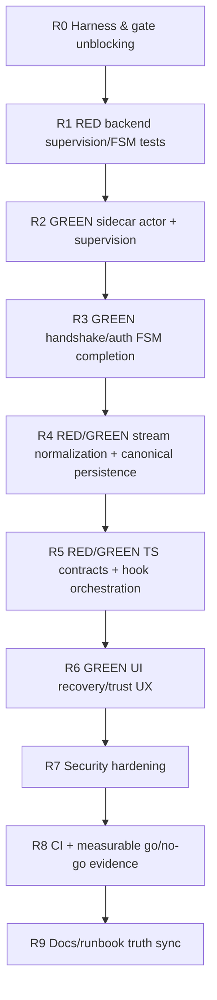

# feat: Hybrid Codex-Claude Capture Reliability v2 (TDD Remediation)

## Table of Contents
- [Objective](#objective)
- [Locked Decisions (No Open Choices)](#locked-decisions-no-open-choices)
- [Public API and Contract Changes](#public-api-and-contract-changes)
- [Dependency Graph (Execution Order)](#dependency-graph-execution-order)
- [Task Graph (Validator Contract)](#task-graph-validator-contract)
- [Execution Checklist](#execution-checklist)
- [Work Breakdown (TDD, Decision-Complete)](#work-breakdown-tdd-decision-complete)
- [Risk to Test Mapping (Mandatory)](#risk-to-test-mapping-mandatory)
- [Acceptance Criteria (Release-Blocking)](#acceptance-criteria-release-blocking)
- [Go/No-Go Metrics (Measured)](#gono-go-metrics-measured)
- [Required CI Test Matrix](#required-ci-test-matrix)
- [Assumptions and Defaults](#assumptions-and-defaults)
- [Execution Notes](#execution-notes)

## Objective
Replace prior “scaffold complete” posture with an execution-ready, test-first remediation plan that makes hybrid capture operable, safe, and measurable:
- supervised sidecar
- reachable auth FSM
- canonical stream persistence
- recoverable UI
- enforced CI reliability gates

## Locked Decisions (No Open Choices)
1. Auth source of truth is sidecar-verified callback only: `account/updated(auth_mode="chatgpt", authenticated=true)`.
2. Hybrid readiness requires all of: `initialize_sent && initialized && auth_state=authenticated && stream_healthy=true`.
3. Stream persistence finalizes only on `item/completed`; deltas are staged.
4. v2 does not add durable in-flight stream staging; restart loss is acceptable because OTEL baseline remains authoritative fallback (explicit non-fatal audit).
5. Kill-switch source of truth is persisted ingest config (`codex.streamKillSwitch`) mirrored to runtime state.
6. Renderer cannot invoke raw stream ingest or health-spoof commands.
7. Crash-loop policy is `>= 3 restarts in rolling 60s` -> `crash_loop`.
8. Recovery targets: degraded visibility p95 <= 5s, MTTR to `HYBRID_ACTIVE` <= 15 minutes in staged drills.

## Public API and Contract Changes
### Backend (Rust/Tauri)
- `/Users/jamiecraik/dev/narrative/src-tauri/src/codex_app_server.rs`
  - Replace stringly runtime state with typed FSM enums.
  - Implement real supervised sidecar actor (`spawn/supervise/shutdown`).
  - Remove/privatize renderer access to:
    - `ingest_codex_stream_event` (internal-only)
    - `codex_app_server_set_stream_health` (internal-only)
  - Keep user-safe commands: status/read, initialize/initialized, auth operations, kill-switch, thread snapshot, dedupe-log (read-only).

### TypeScript Bridge
- `/Users/jamiecraik/dev/narrative/src/core/tauri/ingestConfig.ts`
  - Add `CodexAccountStatus` literal-union type.
  - Change auth wrappers from `Promise<void>` to `Promise<CodexAccountStatus>`.
  - Add wrappers:
    - `getCodexStreamDedupeLog`
    - `codexAppServerRequestThreadSnapshot`

### Hook/UI Contract
- `/Users/jamiecraik/dev/narrative/src/hooks/useAutoIngest.ts`
  - Expose: `recoverHybrid`, `fallbackToOtelOnly`, `retryAuth`, `restartSidecar`.
- `/Users/jamiecraik/dev/narrative/src/ui/components/AutoIngestSetupPanel.tsx`
  - Add degraded/failure action controls wired to hook callbacks.
  - Remove user-visible `UNKNOWN`; keep internal loading-only state.

### Capability Hardening
- `/Users/jamiecraik/dev/narrative/src-tauri/capabilities/default.json`
  - Remove `shell:default`.
  - Narrow shell execution to explicit commands only.
  - Remove or strictly scope `sql:allow-execute` for renderer surface.

## Dependency Graph (Execution Order)


## Task Graph (Validator Contract)
```yaml
tasks:
  - id: T1
    title: R0 Harness and gate unblocking
    depends_on: []
  - id: T2
    title: R1 RED backend supervision and FSM tests first
    depends_on: [T1]
  - id: T3
    title: R2 GREEN real sidecar actor and supervision
    depends_on: [T2]
  - id: T4
    title: R3 GREEN handshake and auth FSM completion
    depends_on: [T3]
  - id: T5
    title: R4 RED GREEN stream normalization to canonical persistence
    depends_on: [T4]
  - id: T6
    title: R5 RED GREEN TS contracts and hook orchestration
    depends_on: [T5]
  - id: T7
    title: R6 GREEN UI recovery and trust UX
    depends_on: [T6]
  - id: T8
    title: R7 Security hardening pass
    depends_on: [T7]
  - id: T9
    title: R8 CI and measurable go no go evidence
    depends_on: [T8]
  - id: T10
    title: R9 Docs and runbook truth sync
    depends_on: [T9]
```

## Execution Checklist
- [x] T1 — R0 Harness and gate unblocking
- [ ] T2 — R1 RED backend supervision and FSM tests first
- [ ] T3 — R2 GREEN real sidecar actor and supervision
- [ ] T4 — R3 GREEN handshake and auth FSM completion
- [ ] T5 — R4 RED/GREEN stream normalization to canonical persistence
- [ ] T6 — R5 RED/GREEN TS contracts and hook orchestration
- [ ] T7 — R6 GREEN UI recovery and trust UX
- [ ] T8 — R7 Security hardening pass
- [ ] T9 — R8 CI and measurable go/no-go evidence
- [ ] T10 — R9 Docs and runbook truth sync

## Work Breakdown (TDD, Decision-Complete)
### T1 — R0 Harness and gate unblocking
- Ensure integration harness runs (`vite.integration.config.ts` and `pnpm test:integration`).
- Add Rust lane (`cargo test`) to CI.
- Exit: integration + Rust lanes execute in CI.

### T2 — R1 RED backend supervision/FSM tests first
- Add failing tests in `/Users/jamiecraik/dev/narrative/src-tauri/src/codex_app_server.rs` for:
  - spawn fail path
  - restart threshold exactness (`>=3`)
  - illegal transition rejection
  - reachable authenticated path
  - `HYBRID_ACTIVE` reachability under healthy preconditions
  - blocked renderer spoof of stream health

### T3 — R2 GREEN real sidecar actor and supervision
- Implement child process actor, stdout/stderr readers, clean shutdown.
- Add rolling-window restart/backoff + crash-loop transition.
- Emit status transition events on every state change.
- Exit: T2 supervision tests pass.

### T4 — R3 GREEN handshake and auth FSM completion
- Enforce strict transition table:
  - `needs_login -> authenticating -> authenticated`
  - unsupported auth mode -> degraded + needs_login
  - logout -> logged_out
  - `account_updated(...authenticated=true, mode=chatgpt)` -> authenticated
- Exit: authenticated-path + hybrid-readiness tests pass.

### T5 — R4 RED/GREEN stream normalization and canonical persistence
- RED tests for staged deltas + finalize on `item/completed` only.
- GREEN implementation:
  - transform completed stream turn into `ParsedSession`-compatible payload
  - route through canonical ingest (`redact -> dedupe -> store -> link`)
  - add bounded dedupe cache (LRU/TTL)
- Exit: one completed turn -> one canonical persisted result; replay deterministic.

### T6 — R5 RED/GREEN TS contracts and hook orchestration
- RED tests for wrapper contracts + hook transitions.
- GREEN implementation:
  - typed auth wrapper returns
  - missing wrappers added
  - recovery/fallback orchestration wired in hook
  - stabilize watcher dependencies to avoid restart churn
- Exit: TS contract + hook tests pass.

### T7 — R6 GREEN UI recovery and trust UX
- Add controls in `AutoIngestSetupPanel`:
  - Recover Hybrid
  - Fallback OTEL-only
  - Retry Auth
  - Restart Sidecar
- Add explicit migration/recovery error handling and user feedback.
- Exit: UI tests verify mode-specific actions and failure visibility.

### T8 — R7 Security hardening pass
- Restrict command/capability surface.
- Validate endpoint/auth-mode inputs strictly.
- Add tests against secret leakage in backup/config workflows.
- Exit: security and capability regression tests pass.

### T9 — R8 CI and measurable go/no-go evidence
- Update `/Users/jamiecraik/dev/narrative/.github/workflows/ci.yml`:
  - OS matrix: ubuntu, macOS, windows
  - required lanes: lint, typecheck, vitest coverage, integration, e2e smoke, cargo test
- Produce `reliability-gates.json` artifact with threshold checks.
- Exit: CI emits pass/fail evidence aligned to release gates.

### T10 — R9 Docs and runbook truth sync
- Update:
  - `/Users/jamiecraik/dev/narrative/docs/plans/2026-02-19-feat-hybrid-codex-claude-capture-reliability-plan.md`
  - `/Users/jamiecraik/dev/narrative/docs/agents/hybrid-capture-rollout-runbook.md`
- Add explicit FAILURE branch handling + rollback success criteria.
- Remove all unsupported “done” claims.
- Exit: docs match runtime behavior + CI evidence.

## Risk to Test Mapping (Mandatory)
1. Auth unreachable -> FSM transition tests + recovery integration path.
2. Crash-loop mismatch -> repeated-exit simulation validates `>=3 in 60s` policy.
3. Stream duplication/loss -> overlap replay + dedupe log determinism assertions.
4. Renderer spoofing -> command authorization denial tests.
5. Memory growth -> event flood tests + cache bound assertions.
6. UI unrecoverable degraded state -> hook+panel integration tests.
7. Silent gate drift -> CI artifact validator vs threshold table.

## Acceptance Criteria (Release-Blocking)
1. `HYBRID_ACTIVE` reached in automated integration scenario.
2. Auth success path ends in `authenticated` and remains stable across reconnect.
3. Crash-loop handling degrades safely at `>=3/60s`.
4. Stream `item/completed` persists via canonical session ingest path.
5. OTEL fallback remains continuous under stream/auth outage.
6. UI exposes mode-appropriate recovery actions.
7. No direct renderer spoof path for raw ingest/health commands.
8. Required CI lanes pass on OS matrix.

## Go/No-Go Metrics (Measured)
- Source ingest success rate (Codex, Claude): >=95% each (24h window).
- Attribution linkage success rate (eligible sessions): >=90% (24h window).
- Degraded visibility latency: p95 <= 5s.
- MTTR (`DEGRADED_STREAMING` -> `HYBRID_ACTIVE`): <=15 min (staged drills).
- Crash-loop containment: no uncontrolled restart storm beyond policy window.
- Silent drop rate: 0 known unaccounted transitions/events in tested scenarios.

## Required CI Test Matrix
- `pnpm lint`
- `pnpm typecheck`
- `pnpm test:coverage`
- `pnpm test:integration`
- `pnpm test:e2e`
- `cargo test --manifest-path /Users/jamiecraik/dev/narrative/src-tauri/Cargo.toml`

## Assumptions and Defaults
- OTEL remains durable baseline; stream enrichment remains additive.
- No new external services for v2.
- Existing DB schema reused for canonical session persistence.
- If stream finalize cannot safely construct a session, event is dropped with explicit audit logging (never silent).
- Development shims may exist locally, but production validation requires supervised runtime behavior.

## Execution Notes
- This plan is the sole source of truth for v2 remediation sequencing.
- Implementation starts only after T1 harness gating is verifiably green in CI.
- Any deviation from locked decisions requires explicit update to this file before code changes.
