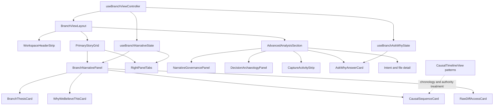
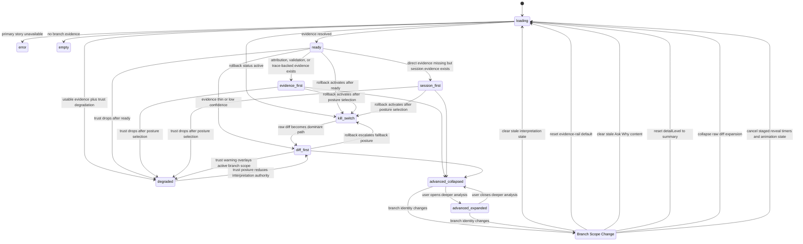

# Branch View Developer Fast Path UI Plan

## Table of Contents

- [Overview](#overview)
- [Contract Locks](#contract-locks)
- [Enhancement Summary](#enhancement-summary)
- [Execution Tracking](#execution-tracking)
- [Component Dependency Map](#component-dependency-map)
- [Branch Scope State Ownership Table](#branch-scope-state-ownership-table)
- [State Diagrams](#state-diagrams)
- [Implementation Phases](#implementation-phases)
- [Visual Testing Strategy](#visual-testing-strategy)
- [Telemetry Implementation Contract](#telemetry-implementation-contract)
- [Accessibility Validation Checklist](#accessibility-validation-checklist)
- [Acceptance Checklist](#acceptance-checklist)
- [Risks and Mitigations](#risks-and-mitigations)
- [Execution Ledger (Planning Mode)](#execution-ledger-planning-mode)
- [Sources & References](#sources--references)

## Overview

This is a `dedicated-ui-plan` for the branch workspace refactor defined by the linked UI spec. The execution target is not a new product surface; it is a calmer, authority-first recompose of the existing `repo` branch workspace so developers can answer four questions quickly and safely:

1. what this branch is about
2. why the app believes that
3. what evidence supports it
4. where to verify or falsify it immediately

The plan follows the UI spec exactly: keep the six-lane shell intact, promote chronology and trust over interpretation, preserve low-confidence and kill-switch fallbacks, and move secondary controls out of the default first-pass reading path.

Execution note:
- The governing contract still targets the `repo` branch workspace.
- A user-approved adjacent extension may apply the same visual language to app-opening surfaces such as `src/ui/views/DashboardMainContent.tsx` and the top `RepoEvidenceOverview` layer when that helps the shipped app reflect the branch-workspace redesign immediately.
- That extension may not change the six-lane shell, branch-scope reset contract, or branch fast-path acceptance criteria.

Execution depth: `deep`

## Contract Locks

The following decisions are locked before execution proceeds past `UP0`:

1. The evidence rail may keep internal tabs in iteration one, but only behind a default-visible verification rail that resolves by verification priority.
2. `BranchSummaryBar` content folds into `WorkspaceHeaderStrip`; it does not survive as an independent first-pass surface.
3. The causal-sequence surface is a branch-specific extraction that borrows chronology framing and authority treatment from `CausalTimelineView`; it is not a blind component reuse.
4. Low-confidence thesis copy still includes factual branch context such as commit or file summary when available.
5. The canonical default DOM and visual order is:
   - `WorkspaceHeaderStrip`
   - `BranchThesisCard`
   - `WhyWeBelieveThisCard`
   - `CausalSequenceCard`
   - `EvidenceRail`
   - `RawDiffAccessCard`
   - `AdvancedAnalysisSection`
6. The canonical first-pass CTA placement is the header CTA group:
   - primary `Inspect evidence`
   - secondary `Open raw diff`
   `RawDiffAccessCard` may repeat the diff route later, but it may not become the first or only diff entry point.

## Enhancement Summary

**Deepened on:** 2026-03-30
**Mode:** targeted-confidence
**Key areas improved:** sequencing, state ownership, verification, rollout evidence, contract lock, executable gates

- Added execution-control rules so layout cleanup, story-card decomposition, and verification-state rewiring do not get blended into one risky pass.
- Strengthened ownership boundaries between `BranchViewLayout`, controller/state hooks, and the evolving evidence rail so branch-scope reset work lands in the right layer.
- Expanded the visual and rollout verification contract to include a required review matrix, stale-state proof, and explicit classification of rollout regressions versus pre-existing failures.
- Resolved the open design and architecture choices that were previously allowing multiple incompatible implementations of the same plan.

## Execution Tracking

**Execution lane:** `plan-led`
**Current slice:** `Slice 2`
**Implementation branch:** `codex/trim-to-vision-phase2-clean`
**Evidence artifact:** `artifacts/branch-view-developer-fast-path-ui-evidence.md`

**Completed phases**

- `UP0` Contract lock and baseline fixture set were synchronized into the evidence artifact, including named approver, canonical order, and fixture classes.
- `UP1` Workspace frame was recomposed in `src/ui/views/BranchViewLayout.tsx` to make story and verification surfaces visible together, and the workspace strip is now folded into `src/ui/components/BranchHeader.tsx` instead of surviving as a separate first-pass surface.
- `UP2` Story rail decomposition landed in `src/ui/components/BranchNarrativePanel.tsx` and `src/ui/components/BranchNarrativePanelSections.tsx`.
- `UP3` Verification rail defaulting, branch-scope reset truthfulness, and primary fast-path telemetry landed in `src/ui/components/RightPanelTabs.tsx`, `src/ui/components/right-panel-tabs/types.ts`, `src/ui/views/branch-view/useBranchViewController.ts`, and `src/core/telemetry/narrativeTelemetry.ts`. The controller now owns verification posture selection, branch-scope reset telemetry, header CTA telemetry, and first-open timing boundaries for evidence and raw diff.

**In progress**

- Approved adjacent extension work is now landing in `src/ui/views/DashboardMainContent.tsx`, `src/ui/components/dashboard/SignalStrip.tsx`, and `src/ui/views/RepoEvidenceOverview.tsx` so the Tauri app opening surfaces inherit the same evidence-brief visual language instead of showing older stacked dashboard panels above the redesigned workspace.
- `UP4` Accessibility and responsive hardening is now the active slice. Advanced-analysis disclosure semantics, branch-scope collapse behavior, controller-backed telemetry proof, verification-rail roving focus, narrow-width control wrapping, reduced-motion-safe verification jumping, small-screen workspace spacing, and focus-visible treatment on primary branch controls are now landed.
- Header CTA grouping semantics and an integration-level proof that first-pass actions stay ahead of advanced-analysis controls are now landed as part of the active `UP4` slice, and the current accessibility lane now includes explicit reduced-motion verification in `BranchView.test.tsx` plus the repo `test:a11y` script.

**Pending**

- `UP5` Full rollout evidence, deeper validation, and sign-off packaging.

**Latest validation snapshot**

- `pnpm test src/core/telemetry/__tests__/narrativeTelemetry.test.ts` -> pass
- `pnpm test src/ui/components/__tests__/RightPanelTabs.test.tsx` -> pass
- `pnpm test src/ui/components/__tests__/BranchHeader.test.tsx` -> pass
- `pnpm test src/ui/components/__tests__/BranchNarrativePanel.test.tsx` -> pass
- `pnpm test src/ui/views/__tests__/BranchView.test.tsx` -> pass
- `pnpm test:a11y` -> pass
- `pnpm typecheck` -> pass
- `pnpm test` -> pass
- `pnpm test:deep` -> pass
- Validation noise remains non-blocking only: `.npmrc` `${NPM_TOKEN}` substitution warning, jsdom canvas warnings, one ECharts sizing stderr line, and the existing React `whileHover` warning in docs-panel tests

## Component Dependency Map

- `src/ui/views/BranchViewLayout.tsx`
  Owns the workspace frame. This is the primary composition boundary for `WorkspaceHeaderStrip`, `PrimaryStoryGrid`, and `AdvancedAnalysisSection`.
- `src/ui/views/branch-view/useBranchViewController.ts`
  Owns branch-scope orchestration, staged reveal timing, right-panel props, telemetry wiring, and the reset conditions that must remain truthful when branch context changes.
- `src/ui/views/branch-view/useBranchNarrativeState.ts`
  Owns narrative interpretation state, detail-level selection, audience/feedback controls, and low-confidence behavior that must be re-homed behind the new disclosure boundary.
- `src/ui/views/branch-view/useBranchAskWhyState.ts`
  Owns `Ask Why` state that must clear on branch-scope change and move into advanced analysis.
- `src/ui/components/BranchNarrativePanel.tsx`
  Current overloaded summary surface. This becomes the main decomposition point for `BranchThesisCard`, `WhyWeBelieveThisCard`, `CausalSequenceCard`, and `RawDiffAccessCard`.
- `src/ui/components/BranchNarrativePanelSections.tsx`
  Holds section-level rendering that must be split into default-visible story cards versus advanced-only controls.
- `src/ui/components/RightPanelTabs.tsx`
  Current verification surface. This evolves into the new evidence rail with verification-priority default selection instead of `session`-first behavior.
- `src/ui/views/CausalTimelineView.tsx`
  Pattern donor for chronology, authority labeling, and support-state styling. This is a reference surface, not an automatic route replacement.
- `src/ui/views/__tests__/BranchView.test.tsx`
  Primary workspace integration coverage for reading order, branch-scope resets, and fallback emphasis.
- `src/ui/components/__tests__/BranchNarrativePanel.test.tsx`
  Component-level regression coverage for card decomposition, low-confidence posture, and advanced-analysis gating.
- `src/ui/components/__tests__/RightPanelTabs.test.tsx`
  Verification-rail coverage for default selection, limited/degraded states, and raw-diff fallback.

### State ownership and sequencing seam

- `BranchViewLayout` should own composition and reading order only. It should not become the source of truth for branch-scope reset behavior, evidence-rail defaults, or low-confidence policy.
- `useBranchViewController` should remain the integration boundary for branch identity, staged reveal timing, telemetry start points, and branch-scope-change coordination across child surfaces.
- `useBranchNarrativeState` should remain the owner of interpretation-local controls such as detail level, audience, observability, and kill-switch-derived detail fallback.
- `useBranchAskWhyState` should remain the owner of `Ask Why` lifecycle, including stale-response protection and branch-scope resets, but its surface placement should move under advanced analysis.
- `RightPanelTabs` may keep internal tabs temporarily, but only behind an evidence-rail contract that chooses visible content by verification priority rather than historical tab state.
- Tests should stay split by responsibility:
  - workspace reading-order and branch-change behavior in `BranchView.test.tsx`
  - story-card and disclosure behavior in `BranchNarrativePanel.test.tsx`
  - evidence defaulting and degraded-state behavior in `RightPanelTabs.test.tsx`

## Branch Scope State Ownership Table

All resettable fast-path state must key off a controller-owned `branchScopeKey`. This table is the execution contract for stale-state prevention.

| State | Owner file | Persistence rule | Reset trigger | Required proof |
| --- | --- | --- | --- | --- |
| `branchScopeKey` | `src/ui/views/branch-view/useBranchViewController.ts` | derived from active branch identity plus branch-defining filters | recompute on branch or qualifying filter change | controller test proves key changes on branch swap |
| staged reveal step and timers | `src/ui/views/branch-view/useBranchViewController.ts` | may persist only within one branch scope | cancel and restart on `branchScopeKey` change | branch `A -> B -> A` test proves old timers do not reveal new scope early |
| staged reveal animation state | `src/ui/views/branch-view/useBranchViewController.ts` | may animate only within one branch scope | reset on `branchScopeKey` change or runtime trust fallback | branch-change proof shows animation state cannot leak across scope swaps |
| advanced-analysis disclosure | `src/ui/views/branch-view/useBranchViewController.ts` | defaults to `collapsed` | reset on every `branchScopeKey` change | integration test proves collapse before new scope resolves |
| verification posture | `src/ui/views/branch-view/useBranchViewController.ts` | resolves once per active branch scope | recompute on branch change, trust change, or evidence availability change | integration test proves posture selection and telemetry payload |
| evidence-rail internal tab or panel | `src/ui/components/RightPanelTabs.tsx` behind controller contract | may persist only within the active branch scope | reset on `branchScopeKey` change or when content disappears | component test proves history cannot override verification-priority default |
| selected evidence item | `src/ui/components/RightPanelTabs.tsx` behind controller contract | may persist only if still valid in the active scope | clear on branch change or invalid reference | component test proves stale evidence does not render after swap |
| selected session | `src/ui/components/RightPanelTabs.tsx` behind controller contract | may persist only when revalidated against the active scope | clear on branch change when linkage is lost | component test proves stale session does not survive scope swap |
| `detailLevel` | `src/ui/views/branch-view/useBranchNarrativeState.ts` | defaults to `summary` | reset on every `branchScopeKey` change and when `kill_switch` forces fallback | integration test proves expanded detail does not survive branch swap |
| audience and feedback-role state | `src/ui/views/branch-view/useBranchNarrativeState.ts` | advanced-only state with no cross-branch persistence | reset on every `branchScopeKey` change | advanced-analysis test proves reset |
| `Ask Why` request, answer, and in-flight token | `src/ui/views/branch-view/useBranchAskWhyState.ts` | no cross-branch persistence | reset on every `branchScopeKey` change | stale async response test proves old answer is dropped |
| raw diff expansion | `src/ui/views/branch-view/useBranchViewController.ts` | may persist only within one branch scope | collapse on `branchScopeKey` change | integration test proves raw diff collapses on swap |
| file selection | `src/ui/views/branch-view/useBranchViewController.ts` plus file-detail children | may persist only if the file still exists in the active scope | clear on branch change when file no longer matches | integration test proves file detail does not point at prior branch |
| queued deep-link action | `src/ui/views/branch-view/useBranchViewController.ts` | no cross-branch persistence | clear on every `branchScopeKey` change | branch-change test proves deferred actions are discarded |

## State Diagrams

### Component Ownership and Data Flow

### Branch Scope Lifecycle and Verification State

## Implementation Phases

### Execution-control rules

- Do not collapse layout, interpretation-card decomposition, and verification-state rewiring into one implementation unit. Each needs its own gate because the regression modes are different.
- Keep legacy verification affordances reachable until `UP3` proves the new evidence-rail defaulting and reset behavior. Removal or hard de-emphasis should happen only after that gate passes.
- Treat branch-scope reset as a controller-and-hook concern, not a component-local convenience behavior. Visual cleanup without truthful reset behavior is not acceptable.
- Stop after each phase if the linked acceptance checks for that layer fail. The next phase may assume the earlier contract is stable, but it may not repair it implicitly.
- Land the work in two execution slices unless evidence proves a single slice is lower risk:
  - Slice 1: `UP1` and `UP2` for workspace frame plus story rail
  - Slice 2: `UP3` through `UP5` for verification, reset truthfulness, telemetry, and sign-off
- `UP0` is a hard contract gate. No product-code refactor may begin until the locked decisions above are recorded in the evidence artifact with one named approver for the chosen direction.

### UP0 - Prototype Pack and Contract Lock

**Execution status:** completed

**Goal:** lock the execution target before production refactoring so the team is building one clear reading model instead of incrementally moving widgets around.

**Dependencies:** none

**Files:**
- Reference: `docs/ui-specs/2026-03-30-branch-view-developer-fast-path-ui-spec.md`
- Reference: `src/ui/views/BranchViewLayout.tsx`
- Reference: `src/ui/components/BranchNarrativePanel.tsx`
- Reference: `src/ui/components/RightPanelTabs.tsx`

**Approach:**
- Capture only two reference layouts before production implementation starts:
  - Baseline: current stacked workspace for before-and-after comparison
  - Target: spec-aligned layout with header strip, story rail, and evidence rail
- Record the locked contract decisions from the UI spec in the evidence artifact, including:
  - evidence-rail internal-tab policy
  - `BranchSummaryBar` fold-in decision
  - causal-sequence extraction strategy
  - low-confidence copy rule
  - canonical DOM and CTA order
- Record one named approver for the locked direction in the evidence artifact.
- Capture the current-state baseline for three branch postures:
  - high-confidence branch
  - low-confidence branch
  - kill-switch or degraded branch
- Capture one mandatory branch-scope reset fixture:
  - branch `A -> B -> A`
- Freeze the evidence artifact path for later rollout proof:
  - `artifacts/branch-view-developer-fast-path-ui-evidence.md`

**Validation:**
- Evidence artifact records the locked contract decisions, named approver, and baseline fixture set.
- The chosen direction preserves the existing shell and only changes the branch workspace contract.
- The chosen direction explicitly matches the canonical DOM and CTA order from the UI spec.
- Required gate: evidence artifact contains the locked-decision checklist, named approver, and the four baseline fixture classes before any product-code edit starts.

**Exit criteria:**
- One approved layout direction exists.
- Baseline screenshots or fixture notes exist for high-confidence, low-confidence, degraded, and `A -> B -> A` branch states.
- No unresolved disagreement remains about reading order, CTA order, verification modes, or reset ownership.

### UP1 - Workspace Frame Recompose

**Execution status:** completed

**Goal:** replace the current stacked branch workspace with the spec-defined frame: `WorkspaceHeaderStrip`, `PrimaryStoryGrid`, and `AdvancedAnalysisSection`.

**Dependencies:** `UP0`

**Files:**
- Modify: `src/ui/views/BranchViewLayout.tsx`
- Review: `src/ui/views/branch-view/useBranchViewController.ts`
- Test: `src/ui/views/__tests__/BranchView.test.tsx`

**Approach:**
- Recompose the current `RepoEvidenceOverview`, `BranchSummaryBar`, `BranchHeader`, `BranchNarrativePanel`, details accordion, and lower follow-through surfaces into three visual layers instead of a long stacked column.
- Keep branch identity, trust posture, and the primary verification CTA above the fold on desktop.
- Preserve reduced-motion behavior and stage-based reveal logic, but remap those reveals to the new section boundaries rather than the old card order.
- Keep file-level detail and intent surfaces in the lower continuation of the page, not inside the primary comprehension canvas.
- Keep existing verification behavior reachable during this phase even if content is visually re-parented. `UP1` is allowed to change layout hierarchy, not evidence-selection truth.

**Validation:**
- Desktop, tablet, and mobile layouts preserve the same reading order.
- The CTA group is visible before file-level detail.
- No horizontal scrolling appears in the primary comprehension region.
- Targeted integration assertions prove the canonical DOM order and CTA placement from the UI spec.
- Required gate: `src/ui/views/__tests__/BranchView.test.tsx` proves the header CTA group renders before file detail and the canonical order is preserved across breakpoint fixtures.

**Exit criteria:**
- `BranchViewLayout` expresses the three-layer workspace contract from the UI spec.
- The top strip remains compact enough that story and verification content are visible together on desktop.
- Existing shell navigation behavior remains unchanged.

### UP2 - Story Rail Decomposition

**Execution status:** completed

**Goal:** break the current narrative panel into a professional, document-like story rail where each default-visible card answers one question only.

**Dependencies:** `UP1`

**Files:**
- Modify: `src/ui/components/BranchNarrativePanel.tsx`
- Modify: `src/ui/components/BranchNarrativePanelSections.tsx`
- Reference: `src/ui/views/CausalTimelineView.tsx`
- Test: `src/ui/components/__tests__/BranchNarrativePanel.test.tsx`
- Test: `src/ui/views/__tests__/BranchView.test.tsx`

**Approach:**
- Split the current default summary area into:
  - `BranchThesisCard`
  - `WhyWeBelieveThisCard`
  - `CausalSequenceCard`
  - `RawDiffAccessCard`
- Borrow chronology and authority cues from `CausalTimelineView` so the sequence surface feels evidence-backed rather than decorative.
- Move `Ask Why`, audience switching, feedback-role switching, highlight voting, and other interpretation-local controls into an advanced-only section.
- Preserve low-confidence and failed states by reducing interpretation authority without hiding factual branch context.

**Validation:**
- The branch thesis is visually dominant over all secondary cards.
- Joined, review-needed, empty, degraded, and failed states remain distinguishable in the story rail.
- Default-visible cards no longer mix feedback tooling with first-pass comprehension.
- Component and integration tests prove `Ask Why`, audience switching, feedback-role switching, and highlight voting are absent from the first-pass area.
- Required gate: `src/ui/components/__tests__/BranchNarrativePanel.test.tsx` proves default-visible cards are limited to thesis, why, sequence, and raw-diff access.

**Exit criteria:**
- The branch story rail is limited to thesis, why, sequence, and raw-diff access.
- Advanced controls are absent from the default first-pass reading area.
- Story cards preserve current trust semantics and fallback behavior.

### UP3 - Verification Rail and Branch-Scope Reset Refactor

**Execution status:** completed

**Goal:** turn the current right panel into a single coherent verification rail that chooses the safest validating path automatically and clears stale interpretation state on branch changes.

**Dependencies:** `UP2`

**Files:**
- Modify: `src/ui/components/RightPanelTabs.tsx`
- Modify: `src/ui/views/branch-view/useBranchNarrativeState.ts`
- Modify: `src/ui/views/branch-view/useBranchAskWhyState.ts`
- Modify: `src/ui/views/branch-view/useBranchViewController.ts`
- Test: `src/ui/components/__tests__/RightPanelTabs.test.tsx`
- Test: `src/ui/views/__tests__/BranchView.test.tsx`

**Approach:**
- Replace implicit `session`-first defaulting with verification-priority selection:
  - attribution or trace-backed evidence
  - validation or test evidence preview mapped into `evidence-first`
  - session evidence
  - raw diff fallback
- Expose verification posture explicitly as `evidence-first`, `session-first`, or `diff-first`, where `evidence-first` covers attribution, trace-backed, and validation/test evidence.
- Derive the evidence-rail initial state from available evidence and trust posture, not from persisted tab history. If internal tabs remain, they must adapt behind the new defaulting contract.
- Implement branch-scope reset rules from the UI spec:
  - collapse advanced analysis
  - clear stale `Ask Why`
  - reselect the evidence rail by verification priority
  - collapse raw-diff expansion when branch identity changes
- Implement the remaining stale-state guards from the state-ownership table:
  - reset `detailLevel` to `summary`
  - cancel staged reveal timers keyed to the old `branchScopeKey`
  - clear stale file selection when it no longer matches the active branch
  - discard queued deep-link actions from the old branch scope
- Add or adapt telemetry so the new fast path measures verification posture, advanced-control usage, and scope resets.

**Validation:**
- Branch-scope changes never leave stale evidence or `Ask Why` content visible.
- Kill-switch and low-confidence branches promote raw diff without hiding trust context.
- The evidence rail can be used without the user needing to understand tab internals first.
- Stale-response protection remains truthful under branch A -> branch B -> branch A flows where old async work could otherwise reappear.
- Targeted tests prove validation and test artifacts resolve to `evidence-first`, not a fourth implicit posture.
- Required gate: `src/ui/components/__tests__/RightPanelTabs.test.tsx` and `src/ui/views/__tests__/BranchView.test.tsx` prove `A -> B -> A` reset behavior, `detailLevel` reset, and timer cancellation.

**Exit criteria:**
- The evidence rail defaults by verification priority instead of historical tab default.
- Stale state is cleared on branch changes before new branch content resolves.
- Verification posture is observable in UI state and telemetry.

### UP4 - Advanced Analysis, Responsive Hardening, and Accessibility

**Execution status:** in_progress

**Goal:** make advanced analysis feel available but clearly secondary, while preserving a clean reading order and accessible state communication across breakpoints without introducing new structural churn.

**Dependencies:** `UP3`

**Files:**
- Modify: `src/ui/views/BranchViewLayout.tsx`
- Modify: `src/ui/components/BranchNarrativePanel.tsx` only for semantics, labels, and responsive hardening
- Modify: `src/ui/components/RightPanelTabs.tsx` only for semantics, labels, and responsive hardening
- Test: `src/ui/views/__tests__/BranchView.test.tsx`
- Test: `src/ui/components/__tests__/BranchNarrativePanel.test.tsx`

**Approach:**
- Do not introduce new hierarchy, card-order, or surface-boundary changes in this phase. `UP4` is a hardening pass only; structural composition must already be settled by `UP1` through `UP3`.
- Consolidate archaeology, governance, capture activity, `Ask Why`, intent detail, and feedback actions into the lower advanced-analysis section only if any residual non-structural cleanup remains after `UP3`.
- Ensure disclosure semantics are explicit and the advanced section is collapsed by default on first load and on branch-scope change.
- Preserve a single logical reading order for keyboard and screen reader users:
  - header strip
  - thesis
  - why we believe this
  - causal sequence
  - evidence rail
  - raw diff access
  - advanced analysis
- Keep trust, degraded, empty, loading, error, and kill-switch states text-labeled rather than color-only.

**Validation:**
- Keyboard focus reaches primary verification actions before advanced controls.
- Mobile keeps the CTA group near the top and avoids horizontal scrolling.
- Reduced-motion mode preserves hierarchy without delayed information reveal.
- Accessibility assertions or focused checks prove the canonical order includes `WhyWeBelieveThisCard` and `RawDiffAccessCard` in the expected reading sequence.
- Required gate: accessibility-focused assertions or equivalent targeted checks prove disclosure semantics and focus order in the canonical reading model.
- Required gate: no new structural refactor is introduced in `UP4`; any remaining changes are limited to semantics, labels, and responsive or accessibility hardening.

**Exit criteria:**
- Advanced analysis is secondary by structure, not just by styling.
- Accessibility semantics match the UI spec for disclosure, focus order, and state messaging.
- Responsive behavior matches the desktop/tablet/mobile contract in the UI spec.

### UP5 - Verification, Rollout Evidence, and Sign-off

**Execution status:** pending

**Goal:** prove the refactor improved comprehension without regressing trust, fallback safety, or branch-scope truthfulness.

**Dependencies:** `UP4`

**Files:**
- Test: `src/ui/views/__tests__/BranchView.test.tsx`
- Test: `src/ui/components/__tests__/BranchNarrativePanel.test.tsx`
- Test: `src/ui/components/__tests__/RightPanelTabs.test.tsx`
- Optional support test: `src/ui/views/__tests__/BranchView.test.ts`
- Evidence artifact: `artifacts/branch-view-developer-fast-path-ui-evidence.md`

**Approach:**
- Add regression coverage for:
  - default reading order
  - advanced-analysis gating
  - low-confidence and kill-switch emphasis
  - verification-priority default selection
  - branch-scope reset behavior
- Add explicit proof for:
  - `detailLevel` reset on branch change
  - staged reveal timer cancellation on branch change
  - stale file-selection and queued-action clearing on branch change
- Capture comparison evidence for desktop, tablet, and mobile using the same representative branch fixtures from `UP0`.
- Record rollout evidence in the evidence artifact with:
  - command log
  - pass or fail outcomes
  - residual risks
  - rollback decision
  - owner sign-off notes
- Classify any failing checks as one of:
  - rollout-introduced regression
  - pre-existing failure
  - unrelated environment issue
  This classification must happen before the team decides whether the UI refactor is blocked.
- Run the branch workspace validation suite:
  - `pnpm lint`
  - `pnpm typecheck`
  - `pnpm test`
  - `pnpm test:deep`

**Validation:**
- Acceptance items `UAC1` through `UAC11` are checked against the final UI.
- Evidence artifact records the exact commands run and the remaining risk posture.
- Phase-level executable gates are satisfied and recorded, not inferred from summary prose.
- Required gate: `artifacts/branch-view-developer-fast-path-ui-evidence.md` includes command output summary, failure classification, telemetry coverage notes, and visual proof references for all mandatory fixtures.

**Exit criteria:**
- All targeted tests pass or any remaining failure is explicitly classified as pre-existing and out of scope.
- Evidence artifact is complete enough for go/no-go review.
- The refactor is ready for `ce-work` or direct implementation handoff.

## Visual Testing Strategy

- Capture a before/after baseline for desktop, tablet, and mobile branch workspace states using the same representative fixtures selected in `UP0`.
- Use three mandatory visual states during review:
  - high-confidence branch
  - low-confidence branch
  - degraded or kill-switch branch
- Use the following review matrix for every sign-off pass:

| Viewport | Mandatory proof |
| --- | --- |
| Desktop | thesis prominence, trust visibility, evidence-rail coherence, CTA before file detail |
| Tablet | preserved reading order, CTA near top, evidence rail stacked below sequence |
| Mobile | no horizontal scroll, thesis first, raw-diff access near top, advanced analysis still collapsed |
| Branch-scope change | stale evidence cleared, stale `Ask Why` cleared, rail reselected by verification priority |

- Validate the default viewport against the UI contract before inspecting lower page content:
  - branch thesis is most prominent
  - trust posture is visible
  - evidence or raw-diff CTA is available
  - advanced controls are absent from the first-pass region
- Prefer targeted DOM assertions and fixture-driven screenshots over broad snapshot churn.
- Capture an explicit branch-scope-change proof sequence showing stale `Ask Why`, evidence selection, and raw-diff expansion clearing before the new branch content resolves.
- Capture an explicit branch-scope-change proof sequence showing `detailLevel` reset, staged reveal timer restart, stale file-selection clearing, and queued-action discard behavior.
- Use the same fixture set for baseline and final review so the team is comparing the refactor, not drifting data conditions.
- Record the final visual review in `artifacts/branch-view-developer-fast-path-ui-evidence.md`.

## Telemetry Implementation Contract

This plan executes the UI-spec telemetry contract and makes `UAC11` falsifiable.

Proof rule:

1. Every event below must be proven by either a targeted automated assertion or a captured evidence-artifact excerpt.
2. Timing events must include at least one recorded before or after sample in the evidence artifact.

| Event | Owner file | Proof required in implementation | Baseline comparison requirement |
| --- | --- | --- | --- |
| `branch_fast_path_loaded` | `src/ui/views/branch-view/useBranchViewController.ts` | test or instrumentation proof that payload includes `branchScopeKey`, `workspaceState`, and `verificationMode` | compare before and after render timing methodology |
| `branch_primary_cta_used` | `src/ui/views/BranchViewLayout.tsx` routed through controller | proof that header CTA usage distinguishes `inspect-evidence` vs `open-raw-diff` | compare CTA split before and after refactor where measurable |
| `branch_advanced_analysis_opened` | `src/ui/views/branch-view/useBranchViewController.ts` | proof that initial open is captured once per scope | compare advanced-analysis open rate against baseline |
| `branch_low_confidence_fallback_used` | controller plus fallback wiring | proof that low-confidence and degraded routes emit the fallback target | compare fallback usage between confidence classes |
| `branch_evidence_open_time_ms` | controller timing boundary | proof that timing starts at fast-path render, not app launch | record before and after measurement path |
| `branch_story_to_diff_time_ms` | controller timing boundary | proof that timing starts at fast-path render, not app launch | record before and after measurement path |
| `branch_verification_mode_selected` | controller verification resolver | proof that only `evidence-first`, `session-first`, or `diff-first` are emitted | compare distribution before and after refactor |
| `branch_scope_reset_occurred` | controller branch-reset path | proof that cleared state keys are listed | compare reset coverage for `A -> B -> A` fixture |
| `branch_advanced_control_used` | advanced-analysis child hooks via controller bridge | proof that advanced-only controls are named consistently | compare control usage after first-pass flow |

Implementation status on 2026-03-30:

- Implemented and covered by code plus targeted proof:
  - `branch_fast_path_loaded`
  - `branch_primary_cta_used`
  - `branch_low_confidence_fallback_used`
  - `branch_evidence_open_time_ms`
  - `branch_story_to_diff_time_ms`
  - `branch_verification_mode_selected`
  - `branch_scope_reset_occurred`
- Still open and carried into `UP4` or `UP5`:
  - `branch_advanced_analysis_opened`
  - `branch_advanced_control_used`

Phase gate:

1. `UP3` may not exit until telemetry owner mappings are implemented or stubbed with explicit TODO ownership in the evidence artifact.
2. `UP5` may not exit until the evidence artifact records which events were reused, which were new, and how baseline comparisons were captured.

## Accessibility Validation Checklist

- [ ] Verify keyboard focus order follows the canonical visual reading order: header strip, thesis, why we believe this, causal sequence, evidence rail, raw diff access, advanced analysis.
- [ ] Verify the primary CTA group is reachable before any advanced-analysis control.
- [ ] Verify trust, degraded, empty, loading, error, and kill-switch states each expose distinct readable text.
- [ ] Verify any retained evidence-rail tab semantics follow APG expectations and hide inactive content from the accessibility tree.
- [ ] Verify the advanced-analysis disclosure exposes correct expanded and collapsed state.
- [ ] Verify raw diff can be reached without hover-only interaction.
- [ ] Verify mobile and tablet layouts preserve the same content order as desktop.
- [ ] Verify reduced-motion mode preserves the same information hierarchy.

## Acceptance Checklist

- [ ] `UAC1` (`VAC1`, `VAC16`) The default workspace presents the canonical reading order `WorkspaceHeaderStrip`, `BranchThesisCard`, `WhyWeBelieveThisCard`, `CausalSequenceCard`, `EvidenceRail`, `RawDiffAccessCard`, `AdvancedAnalysisSection` and keeps the verification CTA group visible before file-level detail.
- [ ] `UAC2` (`VAC2`) The branch thesis is the most visually prominent surface in the workspace.
- [ ] `UAC3` (`VAC3`, `VAC8`, `VAC14`) The evidence rail reads as one coherent verification column and defaults by verification priority rather than `session` history.
- [ ] `UAC4` (`VAC4`, `VAC5`) Trust posture remains visible in the first-pass viewport and degraded or low-confidence states visibly reduce interpretation authority.
- [ ] `UAC5` (`VAC6`, `VAC15`) Kill-switch and low-confidence states promote raw diff without removing branch-thesis context entirely.
- [ ] `UAC6` (`VAC7`) `Ask Why`, audience switching, feedback-role switching, and highlight-voting controls appear only in advanced analysis.
- [ ] `UAC7` (`VAC9`) The causal sequence uses consistent authority and support-state treatment across ready, review-needed, empty, and degraded cases.
- [ ] `UAC8` (`VAC10`) Desktop, tablet, and mobile layouts preserve the same reading order and avoid horizontal scrolling in primary comprehension surfaces.
- [ ] `UAC9` (`VAC11`, `VAC12`, Accessibility 1-8`) Keyboard order, state messaging, and disclosure semantics remain accessible in all primary workspace states.
- [ ] `UAC10` (`VAC13`) Branch-scope changes clear stale interpretation state before the new branch fast path resolves.
- [ ] `UAC11` (`Telemetry 1-9`, UI goals 1-5) The refactor emits or enables measurement for fast-path load, verification posture, CTA usage, advanced-analysis usage, and scope reset events.

## Risks and Mitigations

- **Risk:** scope creep turns a branch-workspace refactor into a broader shell redesign.
  **Mitigation:** keep all work constrained to `repo` branch workspace composition and use the UI spec as the boundary contract.
- **Risk:** moving controls creates hidden regressions in existing branch workflows.
  **Mitigation:** re-home controls behind advanced analysis rather than deleting them, and add explicit regression tests for their availability.
- **Risk:** verification cleanup accidentally hides evidence instead of clarifying it.
  **Mitigation:** require evidence-rail visibility and a reachable validating action in the default viewport for every ready, degraded, and kill-switch state.
- **Risk:** branch-scope persistence bugs leave stale evidence or `Ask Why` content visible.
  **Mitigation:** centralize reset logic in branch-scoped state hooks and add dedicated branch-change tests before sign-off.
- **Risk:** styling borrows from `CausalTimelineView` inconsistently, producing a mixed visual language.
  **Mitigation:** treat `CausalTimelineView` as the canonical pattern donor for chronology and authority treatment, not as one more optional inspiration.
- **Risk:** staged reveal timing or motion polish makes the new layout look calmer while still hiding the wrong information first.
  **Mitigation:** verify hierarchy with reduced motion enabled and require default-viewport proof before reviewing polish states.
- **Risk:** final validation conflates pre-existing test failures with rollout regressions and blocks the wrong work.
  **Mitigation:** classify every failure in `UP5` as rollout-introduced, pre-existing, or environment-related before making the go or no-go decision.

## Execution Ledger (Planning Mode)

STEP_ID | status | owner | evidence
--- | --- | --- | ---
UP0 | completed | frontend | `artifacts/branch-view-developer-fast-path-ui-evidence.md` contract lock, named approver, and baseline fixture classes
UP1 | completed | frontend | `src/ui/views/BranchViewLayout.tsx` plus `src/ui/views/__tests__/BranchView.test.tsx`
UP2 | completed | frontend | `src/ui/components/BranchNarrativePanel.tsx`, `src/ui/components/BranchNarrativePanelSections.tsx`, and `src/ui/components/__tests__/BranchNarrativePanel.test.tsx`
UP3 | completed | frontend | `src/ui/components/RightPanelTabs.tsx`, `src/ui/components/right-panel-tabs/types.ts`, `src/ui/views/branch-view/useBranchViewController.ts`, `src/core/telemetry/narrativeTelemetry.ts`, and targeted verification or telemetry tests
UP4 | in_progress | frontend | Advanced-analysis disclosure semantics, reset telemetry proof, verification-rail roving focus, reduced-motion-safe verification jumping, header CTA grouping, workspace-order proof, wrapped control hardening, focus-visible control treatment, and remaining responsive evidence notes
UP5 | pending | frontend | Evidence artifact plus final command log

## Sources & References

- UI spec: `docs/ui-specs/2026-03-30-branch-view-developer-fast-path-ui-spec.md`
- Parent spec: `docs/specs/2026-03-10-feat-updated-ui-views-spec.md`
- Branch workspace frame: `src/ui/views/BranchViewLayout.tsx`
- Narrative orchestration: `src/ui/views/branch-view/useBranchViewController.ts`
- Narrative state: `src/ui/views/branch-view/useBranchNarrativeState.ts`
- Ask-Why state: `src/ui/views/branch-view/useBranchAskWhyState.ts`
- Narrative surface: `src/ui/components/BranchNarrativePanel.tsx`
- Narrative sections: `src/ui/components/BranchNarrativePanelSections.tsx`
- Verification rail: `src/ui/components/RightPanelTabs.tsx`
- Chronology reference: `src/ui/views/CausalTimelineView.tsx`
- Branch integration tests: `src/ui/views/__tests__/BranchView.test.tsx`
- Narrative panel tests: `src/ui/components/__tests__/BranchNarrativePanel.test.tsx`
- Right-panel tests: `src/ui/components/__tests__/RightPanelTabs.test.tsx`
